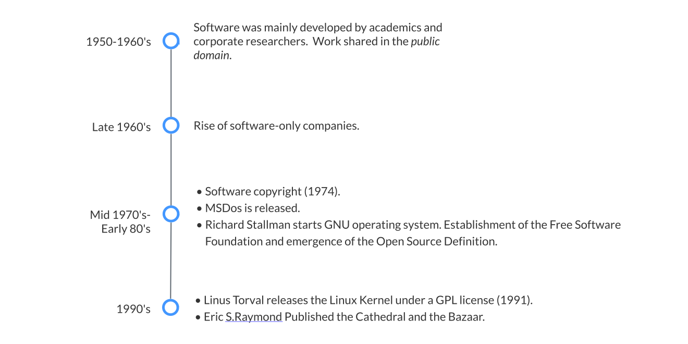

# Chapter 01: Introduction To Open Source

| Learner personas | - [code contributor](../README.md#code-contributor-)  - [code-adjacent contributor](../README.md#code-adjacent-contributor-)  - [manager/stakeholder](../README.md#managerstakeholder-) |
| ---------------- | --------------------------------------------------------------------------------------------------------------------------------------------------------------------------------------------- |
| Pre-requisites   | none                                                                                                                                                                                          |

## Table of Contents 🗂️

- [Chapter 01: Introduction To Open Source](#chapter-01-introduction-to-open-source)
  - [Table of Contents 🗂️](#table-of-contents-️)
  - [Learning Objectives 🧠](#learning-objectives-)
  - [The Origins Of Open Source 🌱](#the-origins-of-open-source-)
  - [Pragmatism vs. Social Movement ✊🏾](#pragmatism-vs-social-movement-)
    - [The Four Freedoms](#the-four-freedoms)
    - [Open Source Definition](#open-source-definition)
  - [InnerSource 🏢](#innersource-)
    - [Benefits of InnerSource](#benefits-of-innersource)
  - [Resources 📚](#resources-)
  - [Continue learning 🚥](#continue-learning-)

## Learning Objectives 🧠

By the end of this section, you should be able to:

- Define open source and describe the main pillars of open source software.
- Understand the difference and similarities between Open Source, Free Software, and InnerSource.

## The Origins Of Open Source 🌱

Sharing software began almost as the computer age emerged the practice of sharing software was often the norm in the early days of Computer Science.

The image below shows a condensed timeline of the Origins of open source.

- In the early years of computing (1950-1960s) software was often a research activity and was often released under the public domain, meaning that these works could not be owned by an individual or a collective.
- Later, in the 1960s, with the rise of compilers and Operating Systems (OS) also came the rise of software-only companies.
- In 1974 software was granted the ability to be copyrighted, which marks the start of software as a commodity.
- In the Early 1980s, the Free Software Foundation (FSF) was founded by Richard Stallman, which was the first organization to advocate for free software. Within that decade Stallman also wrote the [Free Software Definition][free-software-definition].
- Around this same time, the GNU Public License (GPL), was created and the first Linux kernel was released under such license.
- Eric S. Raymond published the ["Cathedral and the Bazaar"][cathedral-and-bazaar] in 1997, an essay comparing two different development models: the Cathedral (top-down development model by an exclusive group of developers) and the Bazaar (where the code is developed publicly over the internet).
- In 1998, the term open source was coined by a group of industry and free software individuals and the Open Source Initiative (OSI) was founded.

## Pragmatism vs. Social Movement ✊🏾

<blockquote>

 Open Source is a development methodology; free software is a social movement. 

 <i> Richard Stallman </i> 

</blockquote>

### The Four Freedoms

The Free Software Foundation is the organization responsible for defending the **Four Freedoms**. These freedoms establish the requisites for a piece of software to be considered free software.

- **Freedom 0**: The freedom to run the program as you wish, for any purpose.
- **Freedom 1**: The freedom to study how the program works, and change it, so it does your computing as you wish. Access to the source code is a precondition for this.
- **Freedom 2**: The freedom to redistribute copies, so you can help others.
- **Freedom 3**: The freedom to distribute copies of your modified versions to others. By doing this you can give the whole community a chance to benefit from your changes. Access to the source code is a precondition for this.

However, the word _free_ in Free Software has often been conflated with _free, as in no price tag included_.

> **Note:** > _Free software_ does not mean _noncommercial_. On the contrary, a free program must be available for commercial use, commercial development, and commercial distribution.

### Open Source Definition

The Open Source Initiative (OSI) is the organization responsible for defending the [**Open Source Definition** (OSD)][os-definition]. The OSD is built on the Four Freedoms and the [Debian Software Guidelines](https://www.debian.org/social_contract#guidelines). It is formed by a set of 10 requirements that a piece of software must meet to be considered open source and is accepted as the single canonical definition of open source:

1. Free Redistribution - The license shall not restrict any party from selling or giving away the software as a component of a larger software distribution containing programs from multiple sources.
2. Source Code - The program must include source code, and must allow distribution in source code as well as compiled form.
3. Derived Works - The license must allow modifications and derived works and must allow them to be distributed under the same terms as the license of the original software.
4. Integrity of The Author’s Source Code - The license may restrict source-code from being distributed in modified form only if the license allows the distribution of “patch files” with the source code to modify the program at build time.
5. No Discrimination Against Persons or Groups - The license must not discriminate against any person or group of persons.
6. No Discrimination Against Fields of Endeavor - The license must not restrict anyone from making use of the program in a specific field of endeavor.
7. Distribution of License - The rights attached to the program must apply to all to whom the program is redistributed without the need for execution of an additional license by those parties.
8. License Must Not Be Specific to a Product - The rights attached to the program must not depend on the program’s being part of a particular software distribution.
9. License Must Not Restrict Other Software - The license must not place restrictions on other software that is distributed along with the licensed software.
10. License Must Be Technology-Neutral - No provision of the license may be predicated on any individual technology or style of interface.

> **Note**
> This definition of open source was coined in an attempt to clarify the concept of free from the [Four Freedoms](#the-four-freedoms), leading to a more pragmatic approach of software development (vs. the social movement approach of free software).

In the OSD the considerations are more technically aligned with a focus on faster and better development involving the community. As a consequence, the Open Source movement has seen more corporate buy-in and adoption.

## InnerSource 🏢

While InnerSource is not a core part of this training, it is worth mentioning it as it is a practice that can be often confused with open source.

InnerSource is the application of open source principles within an organization. It is a practice that aims to increase collaboration and transparency within an organization by using open source tools and methodologies.

> **Note**
> When teams use InnerSource they are developing **proprietary** software and contributions are opened to different teams within the organization

### Benefits of InnerSource

Some typical benefits of InnerSource are:

- Increase code quality earlier in the lifecycle.
- Help establish an open culture within an organization.
- Develop software more collaboratively.
- Increase visibility, transparency, and break down silos.
- Reduction of redundant or duplicate work.
- Reduction of red tape and bureaucracy.

Some early adopters of InnerSource are PayPal, Bosch, Bloomberg, Autodesk, and SanDisk.

## Resources 📚

- [The Free Software Definition][free-software-definition]
- [The Cathedral and the Bazaar][cathedral-and-bazaar]

## Continue learning 🚥

**[Next Chapter: 02 - Types of Open Source Software](./02-types-of-oss.md)** ➡️

<!-- reusable links -->

[free-software-definition]: https://www.gnu.org/philosophy/free-sw.en.html#four-freedoms
[cathedral-and-bazaar]: https://creatingaction.stanford.edu/pdf/cathedral-bazaar.pdf
[os-definition]: https://opensource.org/osd-annotated
