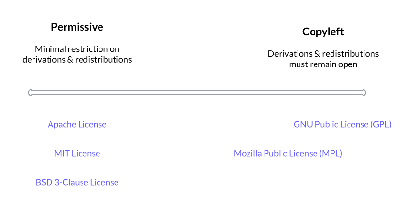

# Chapter 02: Types of Open Source Software

| Learner personas | - [code contributor](../README.md#code-contributor-)  - [code-adjacent contributor](../README.md#code-adjacent-contributor-)  - [manager/stakeholder](../README.md#managerstakeholder-) |
| ---------------- | --------------------------------------------------------------------------------------------------------------------------------------------------------------------------------------------- |
| Pre-requisites   | - [Chapter 01: Introduction To Open Source](./01-intro-to-os.md)                                                                                                                              |

Open source projects have a unified ethos, but can have a varying range of working cultures and atmospheres. In this chapter, we'll learn about some dimensions along which OSS projects can differ.

Let's start by disambiguating a couple of terms for the scope of this chapter — when we say open source software "project" we mean both the:

- "OSS repository" - which includes the codebase, documentation, and design assets, and
- "OSS community" - which refers to everyone who interacts with the repository like users, contributors, and in some cases, corporate sponsors.

The two most common ways to categorize or classify OSS projects are using licenses (to classify the software repository) and governance structures (to classify the community). License and governance inherently influence each other, so we'll use "motivation" as another way to think about types of OSS projects. There is a deep history to the free and open software movement, especially around licenses and governance, which we won't get into in this chapter, but you can read about it in [this Wikipedia article](https://en.wikipedia.org/wiki/History_of_free_and_open-source_software).

## Table of Contents 🗂️

- [Chapter 02: Types of Open Source Software](#chapter-02-types-of-open-source-software)
  - [Table of Contents 🗂️](#table-of-contents-️)
  - [Learning Objectives 🧠](#learning-objectives-)
  - [OSS Licenses 🧑‍⚖️](#oss-licenses-️)
    - [Permissive Licenses](#permissive-licenses)
    - [Copyleft Licenses](#copyleft-licenses)
    - [🙋 Learner Question: Do you know napari's license?](#learner-question-do-you-know-naparis-license)
    - [Contributing License Agreements](#contributing-license-agreements)
    - [License Considerations for Collaboration](#license-considerations-for-collaboration)
  - [OSS Governance ⚖️](#oss-governance-️)
  - [Motivations for OSS Projects 🌱](#motivations-for-oss-projects-)
    - [Academic](#academic)
    - [Company-backed](#company-backed)
    - [Individual/Hobby Projects](#individualhobby-projects)
    - [Community-driven](#community-driven)
    - [🙋 Learner Question: How would you categorize "motivation" for napari?](#learner-question-how-would-you-categorize-motivation-for-napari)
  - [Resources 📚](#resources-)
  - [Continue learning 🚥](#continue-learning-)

## Learning Objectives 🧠

In this chapter, we'll focus on the practical details you need to navigate the different flavours of OSS communities:

- Understand the types of OSS licenses and why/when you should pay attention to them
- Get an overview of governance structures in open source communities
- Learn the motivations behind creating and sustaining open source projects

## OSS Licenses 🧑‍⚖️

Software is fundamentally and legally considered "open source" only if it has a license that enforces the [open source definition][os-definition].

The author of any piece of software holds all rights to it by default, even if the source code is hosted in a public online space. A license is how you "allow" more people to use, modify, and distribute your work, making it "open source" in principle. It gives you attribution while protecting you against legal warranty and liability claims. Licenses also let you set _restrictions_ on how your work can be used and who can use it.

The Open Source Initiative (OSI), a leading authority in the open source movement, recognizes [over a hundred different open source software licenses][osi-license]. These licenses lie on a spectrum of **permissiveness**, from the most permissive to the most protective (copyleft).

### Permissive Licenses

These are licenses with the least restrictions on usage, modifications, and redistributions. MIT, Berkeley Software Distribution (BSD), and Apache are the most popular permissive licenses. These licenses protect you against liability/warrant and provide attribution in derived work. They also put minimal-to-no restrictions on how your software is used. Users are often free to build even commercial and proprietary products with it.

### Copyleft Licenses

Also referred to as protective, restrictive, viral, or repetitive, copyleft licenses require any derivative work to be distributed as openly as the original work. In practice, your software needs a compatible open source license to use or redistribute software with a copyleft license. The most popular copyleft licenses are GNU Public License (GPL), and its variations Affero GNU Public License (AGPL) and Lesser GNU Public License (LGPL).

### 🙋 Learner Question: Do you know napari's license?

[napari is licensed under the BSD 3-Clause license][napari-license], one of the most permissive licenses in the OSS ecosystem.

GitHub presents the details of a license file in an understandable form, you can quickly infer that the napari license:

- permits a broad range of usage, modification, and distribution patterns,
- protects the project against any liability and warranty claims,
- and ensures attribution by requiring the license and copyright notice in derived work.

💡**Tip**: [tl;drLegal][tldr-legal] is another nice resource that presents these legal nuances of licenses using accessible language.

### Contributing License Agreements

While contributing to some OSS projects, perhaps an upstream or downstream project, you may come across Contributor License Agreements (CLAs). A CLA is a legal document that clarifies the intellectual property (IP) rights for the contributions made by an individual or a company. CLAs primarily apply to code, documentation, and design contributions, as well as comments made on issue trackers and discussion forums. This agreement can take different forms, for example a voluntary pledge.

You will typically need to sign CLAs to contribute to high-profile, copyleft-licensed, or corporate-backed projects. It helps ensure the project has all the necessary permissions to use, modify, and distribute your contributions under their chosen open source license.

> **Important**
> If you need to sign a CLA to contribute to a project, especially if you're contributing to it during work hours, check with your management chain to ensure compliance.

### License Considerations for Collaboration

For the most part, you won't need to think about licenses while contributing to open source projects.

> **Important**
> If you add a dependency on or integrate with another open source project, you should confirm if there are any restrictions in the project's license. If there are restrictions, you should verify if your licenses are compatible.

You can find the license file on the project's hosted source repository, and note that sometimes the documentation and design assets may be under a different license than the codebase.

napari's BSD 3-Clause license is compatible with the majority of the other OSS licenses out there. However, if you're unsure about any license clause, raise it along your management chain, and they should be able to guide you.

## OSS Governance ⚖️

As an open source project grows and the number of stakeholders increase, you need structured ways to make decisions and share responsibility. "Governance models" are the formal rules or informal conventions that define key roles and responsibilities for certain members in the community.

It's important to understand the governance model when you contribute to any OSS project. The governance model is how you identify the best community members to comment on and approve major changes to various parts of the project. If you're interested in becoming a long-term contributor, the governance model is also your reference for how to take on more responsibility in the project.

[Red Hat recognizes](https://www.redhat.com/en/resources/guide-to-open-source-project-governance-models-overview) the following common approaches to OSS governance:

- **"Do-ocracy"** — people who do the work make the decisions
- **Founder-leader** — individual (or group) who authored the project make decisions
- **Self-appointed council or board** — the community appoints a group (from within the community) to make decisions
- **Electoral** — community elects certain members for specific roles in the project
- **Corporate-backed** — decisions are made by a company that has a majority stake in the project
- **Foundation-backed** — a non-profit organization is set up (or engaged with) to make decisions

We'll learn more about governance models in the next chapter!

## Motivations for OSS Projects 🌱

Understanding why an OSS project was created (and is maintained) can help you understand the context around the license and governance model choices, why certain decision are made, and the broad future direction of the project.

### Academic

There are several open source projects, especially in the PyData ecosystem, that were created by a research team for their research workflows. The primary motivation for these teams to open source their software is to share it with other teams and reduce duplicate work. While some of these projects can organically gain traction and become [community-driven][community-driven] over time, there are many more that get abandoned after the research project is complete. These projects rarely have the funding or bandwidth to invest in community engagement and sustainability strategies. You will often find them informally following the do-ocracy or founder-leader governance approaches, and adopting permissive licenses.

### Company-backed

Corporate, for/non-profit, companies create and maintain some open source projects for many reasons, including to:

- Reach the open source community to accelerate the development and adoption of their tool,
- Integrate smoothly with other open source projects in the ecosystem,
- Build goodwill and trust among users with transparent development practices,
- Contribute back to projects that are upstream to the company's software stack.

Typically, these OSS projects are critical to a paid (and/or proprietary) product or service that the company offers. It's not surprising for these projects to have restrictive licenses, strong CLAs, and corporate-backed governance structures. However, there are many examples of company-backed projects with permissive licenses and governance like electoral, foundation-backed, or self-appointed council.

### Individual/Hobby Projects

These are projects created (almost entirely) by individuals to solve a problem that they had or simply to build something interesting. The author(s) open sources their hobby projects to share it with other people who might also may also find it helpful and interesting.

Many of these projects are deemed complete after an initial burst of activity and the creator (or other users who become contributors) only focus on minimal maintenance like security updates or bug fixes. Generally, these projects don't have any formal governance models and the project creator(s) makes all the major decisions. They also tend to have permissive licenses to allow for no-strings-attached-sharing.

If these projects gain popularity, they sometimes grow into [community-driven][community-driven] or turn into a [company-backed][company-backed] projects.

### Community-driven

Academic, company-backed, and individual projects can grow a large community (of users, contributors, enthusiasts, advocates, and more) and start being sustained by the community-as-a-whole instead of the original creators. Several projects in the Python and PyData community are community-driven, including foundational projects like NumPy, pandas, and Jupyter. These projects usually lean towards permissive licenses, and electoral or self-appointed-council governance structures, that are clearly defined and documented.

### 🙋 Learner Question: How would you categorize "motivation" for napari?

Based on the [project history](https://napari.org/stable/community/team.html#project-history), we can infer that napari was started as an academic/company-backed project, which has grown into a community-driven project.

## Resources 📚

- [OSI approved licenses][osi-license]
- [A dev's guide to open source software licensing (The ReadME Project)](https://github.com/readme/guides/open-source-licensing)
- [A guide to open source project governance models (Red Hat)][governance-overview-redhat]
- [tl;drLegal][tldr-legal]

## Continue learning 🚥

⬅️ **[Previous Chapter: 01 - Introduction to OSS](./01-intro-to-os.md)** | **[Next Chapter: 03 - Understanding OSS governance](./03-understand-oss-governance.md)** ➡️

<!-- reusable links -->

[os-definition]: https://opensource.org/osd-annotated
[osi-license]: https://opensource.org/licenses/
[napari-license]: https://napari.org/stable/community/licensing.html
[governance-overview-redhat]: https://www.redhat.com/en/resources/guide-to-open-source-project-governance-models-overview
[community-driven]: #community-driven
[company-backed]: #company-backed
[tldr-legal]: https://www.tldrlegal.com/
