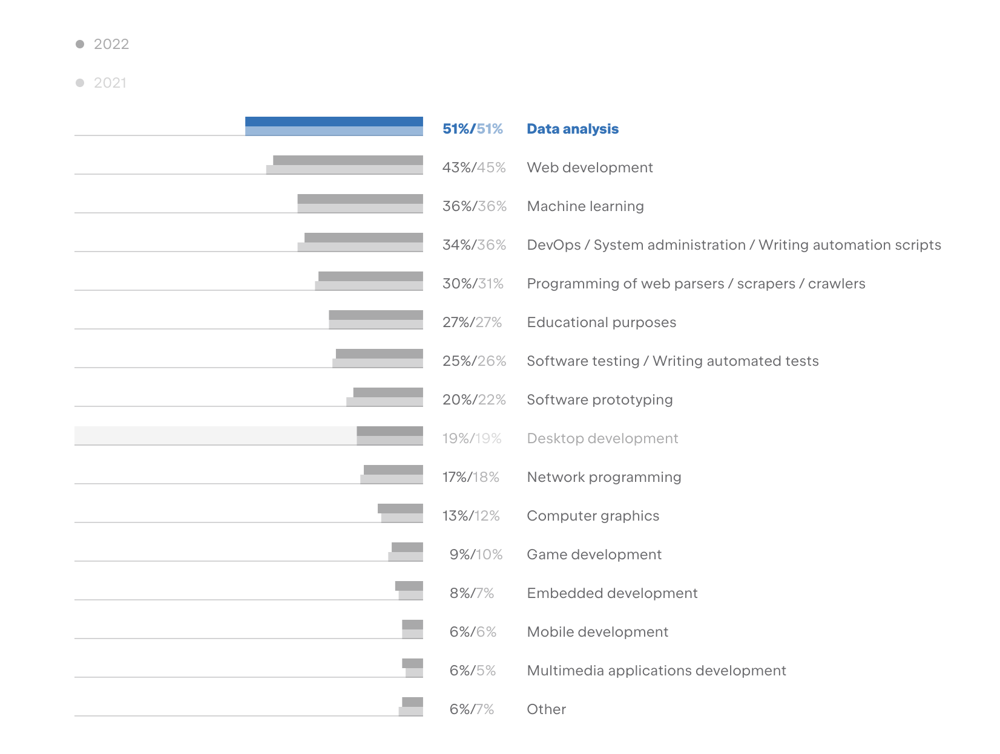

# Chapter 03: Understanding Open Source Governance

| Learner personas | - [code contributor](../README.md#code-contributor-)  - [code-adjacent contributor](../README.md#code-adjacent-contributor-)  - [manager/stakeholder](../README.md#managerstakeholder-) |
| ---------------- | --------------------------------------------------------------------------------------------------------------------------------------------------------------------------------------------- |
| Pre-requisites   | - [Chapter 01: Introduction To Open Source](./01-intro-to-os.md)  - [Chapter 02: Types of Open Source Software](./02-types-of-oss.md)                                                      |

At it's core, governance is a way for the open source community to align on _who makes decisions_ and _how decisions are made_, and the permutations like _how decisions are made about who makes the decisions_. Governance models answer these questions by defining roles in the projects and the powers they have.

  

## Table of Contents 🗂️

- [Chapter 03: Understanding Open Source Governance](#chapter-03-understanding-open-source-governance)
  - [Table of Contents 🗂️](#table-of-contents-️)
  - [Learning Objectives 🧠](#learning-objectives-)
  - [Governance models ⚖️](#governance-models-️)
    - [Benevolent Dictator for Life (BDFL)](#benevolent-dictator-for-life-bdfl)
    - [Core team](#core-team)
    - [Elected council](#elected-council)
    - [Council \& subcommittees](#council--subcommittees)
    - [A note on terminology](#a-note-on-terminology)
  - [Enhancement Proposals 📑](#enhancement-proposals-)
    - [🙋 Learner question: Do you know how napari is governed?](#learner-question-do-you-know-how-napari-is-governed)
  - [Navigating Governance Structures 🧑‍⚖️](#navigating-governance-structures-️)
  - [OSS project management 📁](#oss-project-management-)
  - [Interlude: Broader open source software community 🌱](#interlude-broader-open-source-software-community-)
    - [🙋 Learner questions: Where does napari fit it the OSS ecosystem?](#-learner-questions-where-does-napari-fit-it-the-oss-ecosystem)
  - [Resources 📚](#resources-)
  - [Continue learning 🚥](#continue-learning-)

## Learning Objectives 🧠

Building on the governance approaches discussed in the previous chapter, in this chapter, you'll learn:

- Some actual and concrete governance models used by the OSS community
- How to navigate the governance structures and hierarchies in OSS projects
- How napari fits into the PyData, Python, and broader open source software ecosystem

## Governance models ⚖️

Let's start by looking at four common ways to define _who makes decisions_ in an OSS project. Though it is important to keep in mind that projects usually adopt a combination of two or more of the models described here.

### Benevolent Dictator for Life (BDFL)

The term BDFL was popularized by Guido van Rossum, creator of the Python programming language[^1].
In this model, the creator of an open source project takes the title of "BDFL" and has the final say in all decisions for the project.
Examples of projects with BDFLs are the Linux Kernel, pandas, and SciPy.

[^1]: [Guido stepped down as Python's BDFL in 2018, which led to the formation of the Python Steering Council.](https://peps.python.org/pep-0013/#history)

> **Note:**
> Even if projects have BDFLs, they rarely make decision alone, and have additional teams or advisors to share the responsibility.

### Core team

In this model, a group of sustainers[^2] are the project leaders and final decision makers.
The group may have internal processes like majority vote or a [consensus-based](https://www.sociocracyforall.org/the-difference-between-whole-group-consensus-and-dynamic-governance-sociocracy/) approach to make decisions.
Projects with this governance model have pathways for:

- community members to start contributing,
- become regular contributors with more privileges like merge-rights, and
- eventually join the core team involving a community or self nomination, followed by discussion and approval by the core team.

In the PyData ecosystem, the pandas and Bokeh projects have core team governance structure.

[^2]: The term "maintainers" tends to be associated with code maintainers. So, we use the term "sustainer" instead of "maintainer" in this training to include all kinds of contributions to the OSS project.

### Elected council

Similar to the core team, the elected council model also involves a team of sustainers taking on project leadership.
The main difference is that they are elected by the community and council members serve a fixed term.
The Python project and the Kubernetes project have good implementations of the elected council governance model.

### Council & subcommittees

Beyond a certain scale or complexity, projects start having different specialized areas with experts in each area.
It's important for these areas and experts to be recognized and involved in decisions that affect the whole community.

The council & subcommittee model is a two-tiered approach to governance.
The council (usually elected, but sometimes core-team-like) is responsible for overall direction and community-wide-decisions, and subcommittees are created to lead and make decisions for specific areas of the project.
The two tiers work collaboratively, with the council advising the subcommittees and the committees representing their particular area in community discussions.

Examples of this governance model are the [Kubernetes project with "Special Interest Groups"](https://github.com/kubernetes/community/blob/master/kubernetes_governance_diagram.png), and the [Jupyter Project with the "Software Steering Council"](https://jupyter.org/governance/overview.html).

### A note on terminology

The terms used above like "core team", "elected council", etc., are not formal terms but a best-approximation for describing and understanding governance models.
The spirit behind each model and their difference are more important.
Moreover, every project implements governance differently and will have project-specific nuances.

For instance, the NumPy project has a "steering council".
They don't have an explicit community vote for joining the council, they follow a process similar to the one described in the [Core team model](#core-team).

## Enhancement Proposals 📑

The second half of governance involves _how decisions are made_.
In the Python and PyData ecosystem, community decision-making takes the form of "Enhancement Proposals".
Enhancements proposals are a structured way for contributors to share ideas for a new feature or major change, propose details and impact, and gather feedback the commuting before proceeding with implementation.
Enhancement Proposal are for large scale or community-wide topics, many day-to-day decisions can be made after quick discussions on the project's communication platform like GitHub issues.
Examples of Enhancement proposals are [Python's PEPs](https://peps.python.org/pep-0001/), [NumPy's NEPs](https://numpy.org/neps/nep-0000.html), [Kubernetes' KEPs](https://github.com/kubernetes/enhancements/blob/master/keps/sig-architecture/0000-kep-process/README.md), etc.

> **Note:**
> Other terms for Enhancement Proposals are "Advancement Proposals", "Request for Discussion" (RFDs), or "Request for Comments" (RFCs).

### 🙋 Learner question: Do you know how napari is governed?

Read [napari's governance](https://napari.org/stable/community/governance.html#) and [Napari Advancement Proposal (NAP) process](https://napari.org/stable/naps/0-nap-process.html#what-is-a-nap) in the project documentation!

## Navigating Governance Structures 🧑‍⚖️

You do not need to read the governance for every project you contribute to.
Understanding and following the governance structure becomes important as you start contributing to a project regularly, especially large-scale projects.
It's how the community has decided to collaborate, and as a member of the community you're expected to respect that.
You will find the governance models in the project's community documentation, contributor's guide, or repositories dedicated to project management.

> **Note:**
> The term "governance" is often overloaded, and you may sometimes find a project's contribution guidelines, Code of Conduct, license files, project management notes, and more documented under the governance umbrella.

## OSS project management 📁

Unlike corporate and academic projects, open source software projects don't have formal project management systems beyond a project roadmap, release milestones, and some issues (features, tasks, or bugs) marked as important.

Volunteers or enthusiasts contribute to areas of the project that interest them and adopt project management systems (e.g., Kanban board or Gantt chart) that work best for them.
As a contributor or team of contributors, you can do that too, but make sure to communicate and share your system with the broader community and the appropriate governing group.

## Interlude: Broader open source software community 🌱

Open source software forms a critical part of our digital infrastructure, powering everything from internet security to household televisions. The Python programming language, and the surrounding community, is but one piece of this massive ecosystem.

There is a saying in the Python community: "Python is the second-best language for anything", and it can be backed by data. The [Python Developer Survey 2022][developer-survey] shows how people use Python for web development, game development, network programming and more, in addition to data analytics and machine learning. There are several open source projects associate with these use-cases within the Python community. For example, there is a large and lovely community around the Django project.

  

Likewise, there is a vibrant community of people using Python for scientific research and industry data science. They use Python for data analysis, data visualization, machine learning, high performance computing, and more. We have foundational projects like NumPy at the core of numerical computing, domain-specific projects like AstroPy, and technique-specific projects like scikit-image, as described in this figure from [Array programming with Python](https://www.nature.com/articles/s41586-020-2649-2):

  

All of these projects are built to interoperate with each other and are most powerful when working together, hence creating an ecosystem. We call this the PyData[^3], Scientific Python[^4], or Python data science ecosystem.

[^3]: [PyData is also a meetup and conference series by NumFOCUS.](https://pydata.org/)
[^4]: [Scientific Python is also a loose-federation of some projects in the ecosystem of Python tools for science and data work.](https://scientific-python.org/)

### 🙋 Learner questions: Where does napari fit it the OSS ecosystem?

napari is a part of PyData (and hence, broader Python) ecosystem. It's a technique-specific project (high-dimensional imaging) and leans towards the bioscience domain.

## Resources 📚

- [Governance 6 types and 3 models by Josh Berkus at Red Hat OSPO](https://berkus.org/gov6/#1)
- [Napari community documentation](https://napari.org/stable/community/)
- [Python Developer Survey 2022 results][developer-survey]
- [Roads and Bridges: The Unseen Labor Behind Our Digital Infrastructure](https://www.fordfoundation.org/media/2976/roads-and-bridges-the-unseen-labor-behind-our-digital-infrastructure.pdf)

## Continue learning 🚥

⬅️ **[Previous Chapter: 02 Types of Open Source Software](./02-types-of-oss.md)** | **[Next Chapter: 04 How Does OSS Relate To The Open Research Movement?](./04-oss-and-open-science.md)** ➡️

<!-- reusable links -->

[developer-survey]: https://lp.jetbrains.com/python-developers-survey-2022/#PurposesUsingPython
