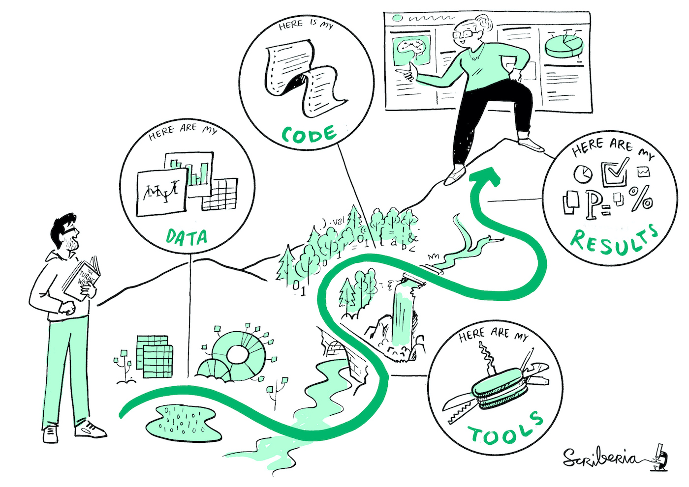
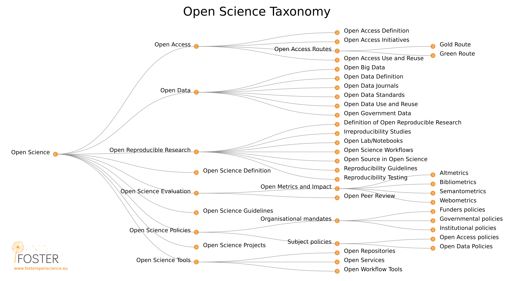
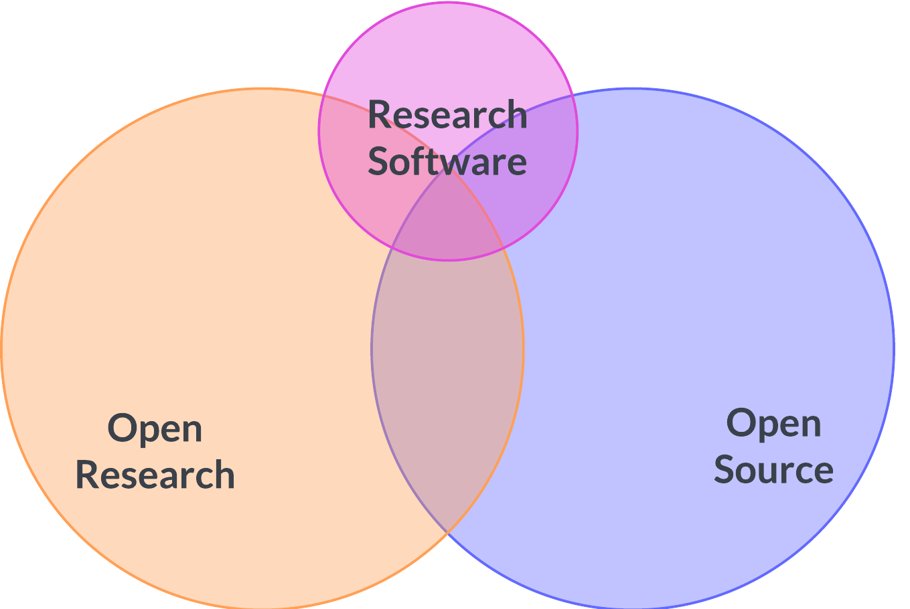

---
Learner personas:
  - code contributor
  - code-adjacent contributor
  - manager/stakeholder
Pre-requisites:
  - "Chapter 01: Introduction To Open Source"
  - "Chapter 02: Types of Open Source Software"
  - "Chapter 03: Understanding OSS Governance"
---

# Chapter 04: How Does OSS Relate To The Open Research Movement?

## Table of Contents 🗂️

- [Chapter 04: How Does OSS Relate To The Open Research Movement?](#chapter-04-how-does-oss-relate-to-the-open-research-movement)
  - [Table of Contents 🗂️](#table-of-contents-️)
  - [Learning Objectives 🧠](#learning-objectives-)
  - [Introduction to Open Research 🔭](#introduction-to-open-research-)
  - [Open Research in practice 👩🏻‍💻](#open-research-in-practice-)
  - [Open Research and Open Source 💻](#open-research-and-open-source-)
  - [Resources 📚](#resources-)
  - [Continue learning 🚥](#continue-learning-)

## Learning Objectives 🧠

By the end of this section, you should be able to:

- Get an overview of Open Research and its main principles and practices.
- Understand how Open Research relates to Open Source.

## Introduction to Open Research 🔭

Open Research (often referred to as Open Science[^1]) aims to transform the way research is carried out and disseminated. Its primary focus is making research more reproducible, transparent, reusable, collaborative, accountable, equitable, and accessible to society.

[^1]: The term Open Science is often used interchangeably with Open Research. However, Open Research is a more inclusive term that encompasses Open Science and other research practices such as Humanities and Social Sciences.

The [Organization for Economic Co-operation and Development (OECD)](https://read.oecd-ilibrary.org/science-and-technology/making-open-science-a-reality_5jrs2f963zs1-en#page1) defines Open Science as:

> The practice of making the primary outputs of publicly funded research results – publications and the research data – publicly accessible in a digital format with no or minimal restriction.

To achieve such goals Open Research relies on several practices such as Open Access, Open Data, Open Software, Open Educational Resources, Reproducible Science, Co-creation, Public Engagements, and Citizen Science. It also builds and expands on the principles of [FAIR data (Findable, Accessible, Interoperable, Reusable)][fair-principles].

## Open Research in practice 👩🏻‍💻

To ensure Research is truly open, every element of the research lifecycle should be publicly available, reusable, and transparent. This includes:

- **Open Data:** Documenting and sharing data in a way that is accessible, reusable, and interoperable. This includes data from experiments, surveys, and other research activities and associated metadata.
- **Research Software:** Documenting and making software and computational workflows public. This includes software used to analyze and clean data, run simulations, and other research activities.
- **Open Hardware:** Documenting and making hardware designs and other materials related to hardware public and accessible.
- **Open Access:** Making all research publications (and other published outputs) publicly available and accessible.

<figure>

<figcaption>
The Turing Way project illustration by Scriberia. Used under a CC-BY 4.0 licence. <a href="https://doi.org/10.5281/zenodo.3332807"> DOI: 10.5281/zenodo.3332807</a>
</figcaption>
</figure>

Open Scolarship[^2] builds on the principles and practices of Open Research but extends to other aspects of research such as:

- **Open educational resources:** Making educational resources such as course materials, textbooks, and other learning materials publicly available and accessible.
- **Equity, diversity, inclusion:** Ensuring scholarship is open and accessible to everyone without barriers based on factors such as gender, background, disability status, sexual orientation, etc.
- **Citizen science:** The inclusion of members of the public in scientific research. This includes the public in the design, data collection, and analysis of research.

[^2]: Open Scholarship is a term used to describe the combination of Open Research and Open Education. It relates to making other aspects of scientific research open to the public such as open educational resources, having inclusive practice and citizen science.

Below is a more comprehensive taxonomy of Open Science by [FOSTER](https://www.fosteropenscience.eu/resources).

## Open Research and Open Source 💻

The [Open Definition][open-definition] sets out several principles that define openness about data and content (including software) and is widely used across Open Research contexts. The Open Definition can be summarized as follows:

> Open data and content can be freely used, modified, and shared by anyone for any purpose.

Additionally, the Open Definition was originally derived from the Open Source Definition and retains many of its principles such as:

- freedom to use, modify, and share
- no discrimination against fields of endeavour, individuals, or groups of people

Additionally, it requires that any content is distributed under an open license compatible with other open licenses (e.g. OSI licenses such as MIT, BSD-3, etc.).
Research software outputs adhering to the Open Definition should then be distributed under an open license, though to be considered Open Source, the software must also meet the [Open Source Definition](https://opensource.org/osd-annotated) as described in the [Introduction to OSS chapter](./01-intro-to-os.md).

It is important to remember that Open Research encompasses other practices as described in the [Open Research in Practice](#open-research-in-practice-) section. Research software is only a small component of Open Research and not all research software is Open Source or even open at all.

## Resources 📚

- [Licenses conformant with the Open Definition](https://opendefinition.org/licenses/)
- [Licenses nonconforming with the Open Definition](https://opendefinition.org/licenses/nonconformant/)
- [UNESCO Recommendations for Open Science](https://en.unesco.org/science-sustainable-future/open-science/recommendation)

## Continue learning 🚥

<!-- TODO: update link to chapter 03 -->

⬅️ **[Previous Chapter: 03 - Understanding OSS Governance](./01-intro-to-os.md)**

<!-- reusable links -->

[fair-principles]: https://www.go-fair.org/fair-principles/
[open-definition]: https://opendefinition.org/od/2.1/en/
