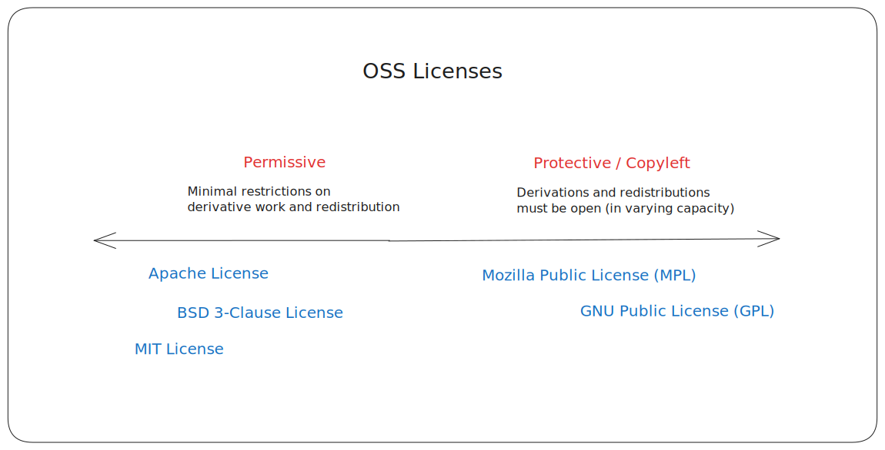
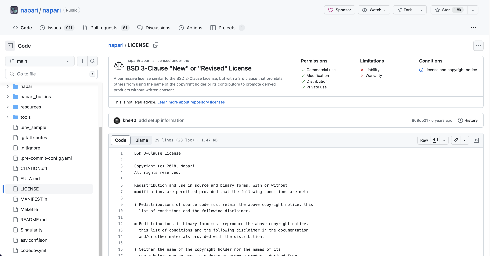

# Types of Open Source Software

<!-- TODO: Add link to chapter 1.01 in the prerequisites section when ready -->

---

Learner personas: Code contributor, manager/stakeholder
Pre-requisites: 1.01 Introduction to OSS

---

Open source projects have a unified ethos, but can have a broad range of working cultures and atmospheres. In this chapter, we’ll learn about some dimensions along which OSS projects can differ.

Let’s start by disambiguating a couple of terms for the scope of this chapter — when we say open source software “project” we mean both the:

- “OSS repository” - which includes the codebase, documentation, and design assets, and
- “OSS community” - which refers to everyone who interacts with the repository like users and contributors.

The two most common ways to categorize or classify OSS projects are using licenses (to classify the software repository) and governance structures (to classify the community). License and governance inherently influence each other, so we'll use "motivation" as another way to think about types of OSS projects. There is a deep history to the free and open software movement, especially around licenses and governance, which we won’t get into in this chapter, but you can read about it in [this Wikipedia article](https://en.wikipedia.org/wiki/History_of_free_and_open-source_software).

In this chapter, we’ll focus on the practical details you need to navigate the different flavours of OSS communities:

- Understand types of OSS licenses and why/when you should pay attention to them
- Overview of governance structured in open source communities
- Motivation behind creating and sustaining open source projects

## OSS licenses

A software is fundamentally, and legally, considered "open source" only if it has a license that enforces the [open source definition](https://opensource.org/osd/).

The author of any piece of software holds all rights to it by default, even if the source code is hosted in a public online space. A license is how you "allow" more people to use, modify, and distribute your work, making it "open source" in principle. It gives you attribution, while protecting you against legal warranty and liability claims. Licenses also let you set _restrictions_ on how your work can be used and who can use it.

Open Source Initiative (OSI), a leading authority in the open source movement, recognizes [over a hundred different open source software licenses](https://opensource.org/licenses/). These licenses lie on a spectrum of **permissiveness**, from the most permissive to the most protective (copyleft).

### Permissive licenses

These are licenses with the least restrictions on usage, modifications, and redistributions. The most popular permissive licenses are MIT, Berkeley Software Distribution (BSD), and Apache license. These licenses protect you against liability/warrant and provide attribution in derived work. Other than that, they put minimal-to-no restrictions on how your software is used. Users are often free to build even commercial and proprietary products with it.

### Copyleft licenses

Also referred to as protective, restrictive, viral, or repetitive, copyleft licenses require any derivative work to be distributed as openly as the original work. In practice, your software needs to have a compatible open source license to use or redistribute a software that has a copyleft license. The most popular copyleft licenses are GNU Public License (GPL), and it’s variations Affero GNU Public License (AGPL) and Lesser GNU Public License (LGPL).

### 🙋 Learner question: Do you know napari’s license?

napari is under the BSD 3-Clause license, one of the most permissive license in the OSS ecosystem: https://github.com/napari/napari/blob/main/LICENSE

GitHub presents the details of a license file in a digestible form, you can quickly infer that the napari license:

- permits a broad range of usage, modification, and distribution patterns,
- protects the project against any liability and warranty claims,
- and ensures attribution by requiring the license and copyright notice in derived work.

💡**Tip**: [tl;drLegal](https://www.tldrlegal.com/) is also a nice resource that presents these legal nuances in accessible language.

### Contributing License Agreements

If you contribute to a different project, maybe an upstream or downstream project, you may come across Contributor License Agreements (CLAs). A CLA legally clarifies the intellectual property (IP) rights for the contributions made by an individual or a company. CLAs primarily apply to code, documentation, and design contributions, as well as comments made on issue trackers and discussion forums. This agreement can take a few different forms, for example a voluntary pledge.

You will typically need to sign CLAs to contribute to high-profile, copyleft-licensed, or corporate-backed projects. It helps ensure the project has all the necessary permissions to use, modify, and distribute your contributions under their chosen open source license.

❗️**Important:** If you need to sign a CLA to contribute to project, especially if you’re contributing to it during work hours, check with your management chain to ensure compliance.

### License considerations for collaboration

For the most part, you won’t need to think about licenses while contributing to open source projects.

❗️**Important:** If you add a dependency on or integrate with another open source project, you should confirm if there are any restrictions in the project’s license. If there are restrictions, you should verify if your licenses are compatible.

You can find the license file on the project’s hosted source repository, and note that sometimes the documentation and design assets may be under a different license than the codebase.

Napari’s BSD 3-Clause license is compatible with majority of the other OSS licenses out there. However, if you’re un-sure any about any license clause, raise it along your management chain and they should be able to guide you.
