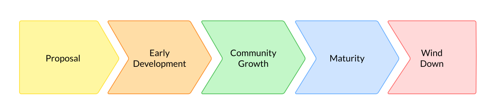

How to be a good corporate citizen

# Chapter 02: Being a Good Open Source Citizen as a Corporate Contributor

<!-- TODO: Verify chapter links after 2.01 is merged -->

| Learner personas | - [code contributor](../README.md#code-contributor-)  - [code-adjacent contributor](../README.md#code-adjacent-contributor-)  - [manager/stakeholder](../README.md#managerstakeholder-) |
| ---------------- | --------------------------------------------------------------------------------------------------------------------------------------------------------------------------------------------- |
| Pre-requisites   | [Module 02 - Chapter 01: Why and How to Contribute to Open Source](./01-why-contribute-to-oss.md)                                                                                             |

## - [Chapter 02: Being a Good Open Source Citizen as a Corporate Contributor](#chapter-02-being-a-good-open-source-citizen-as-a-corporate-contributor)

- [Chapter 02: Being a Good Open Source Citizen as a Corporate Contributor](#chapter-02-being-a-good-open-source-citizen-as-a-corporate-contributor)
  - [- Chapter 02: Being a Good Open Source Citizen as a Corporate Contributor](#--chapter-02-being-a-good-open-source-citizen-as-a-corporate-contributor)
  - [Learning Objectives 🧠](#learning-objectives-)
  - [OSS Project Life Cycle 🦋](#oss-project-life-cycle-)
    - [1. Proposal](#1-proposal)
    - [2. Early-development](#2-early-development)
    - [3. Community growth](#3-community-growth)
    - [4. Maturity](#4-maturity)
    - [5. Wind-down](#5-wind-down)
  - [Familiarize with Community Standards](#familiarize-with-community-standards)
  - [Build Consensus and Keep Stakeholders Aligned](#build-consensus-and-keep-stakeholders-aligned)
  - [Turn Private Conversations to Public Resources](#turn-private-conversations-to-public-resources)
  - [Co-creation and Participating as a Corporate Sponsor](#co-creation-and-participating-as-a-corporate-sponsor)
  - [Examples of Good Corporate Sponsorship](#examples-of-good-corporate-sponsorship)
  - [Resources 📚](#resources-)

## Learning Objectives 🧠

<!-- TODO: Populate as new sections are added -->

## OSS Project Life Cycle 🦋

Every project has a unique trajectory, but we can outline some common themes in their life cycle. Understanding the life cycle is important while contributing as a corporate organization, because the support plays an important role across the project life cycle.

An open source project can go through the following stages, in varying degrees and for varying durations:

### 1. Proposal

An individual or a group identifies a problem that can be solved with software. They may either need to create a new opens source tool from scratch, or create an open source equivalent to a proprietary solution. In this stage, they develop a concrete project proposal by ideating on topics like:

- Scope and goals for the project
- User workflows and comparisons to alternatives
- Software development stack and architecture
- Development timeline and deliverables
- Resource requirements

The project may add more initial authors to the team, look for incubation opportunities, or share the proposal to corporate management to get funds for early development work.

### 2. Early-development

With a set direction, the project enters a rapid development phase. Teams usually follow an agile approach to development -- they release small-scoped working software and incrementally improve it. In this stage, initial authors work to:

- Adopt an appropriate OSS license
- Release the first few versions of the project
- Create documentation to onboard new users
- Find early users within the broader community or company
- Improve the project quickly based on user feedback

### 3. Community growth

As the project improves, it attracts more users and eventually more contributors. A community starts developing around the project. In this stage, teams:

- Set up community forums, Code of Conducts, and community governance models
- Work on community engagement strategies to support the community and gather feedback effectively
- Promote the project broadly at conferences, podcasts, newsletters, and more
- Improve community documentation, especially for various kinds of contributors
- Continue improving the project and make releases in quick succession
- Begin focusing on maintenance activities in addition to enhancement tasks

### 4. Maturity

The project eventually reaches a steady state of growth with a dedicated community. This stage is signified by:

- A linear or plateaued community growth which includes several public advocates for the project
- A regular cadence and process for project releases
- Several active downstream project
- Maintenance taking priority over feature development

This stage is often where initial authors and early maintainers can feel burnout, and a good sustainability strategy is critical for the project to stay healthy.

### 5. Wind-down

The project will eventually see a community stagnation or decline. It can happen after years or decades because a newer and faster alternative exists, the user base has saturated, the core sustainers have burnt out, the project needs no critical improvements, or some other reason.

This is a stage where the project leadership wind-down activities, and

- Decide to archive it, shut it down, or transfer it to a different space for continued maintenance
- Update the project repository, documentation, forums, and more, to indicate the decreased activity and direct new users to alternative spaces
- Works with the community for a graceful transition without major disruptions

It is critical to recognize when a project has stalled and needs to wind down. A clear decision helps the project community adopt better tools and practices and smoothly direct their contribution efforts to other projects.

## Familiarize with Community Standards

<!-- TODO: https://github.com/Quansight-Labs/czi-oss-training/issues/40 -->

## Build Consensus and Keep Stakeholders Aligned

<!-- TODO: https://github.com/Quansight-Labs/czi-oss-training/issues/37 -->

## Turn Private Conversations to Public Resources

<!-- TODO: https://github.com/Quansight-Labs/czi-oss-training/issues/36 -->

## Co-creation and Participating as a Corporate Sponsor

<!-- TODO: https://github.com/Quansight-Labs/czi-oss-training/issues/17 -->

## Examples of Good Corporate Sponsorship

<!-- TODO: https://github.com/Quansight-Labs/czi-oss-training/issues/42 -->

## Resources 📚

<!-- TODO: Populate as new sections are added -->

- [The Life Cycles of Open Source Projects, by The Linux Foundation](https://lfx.linuxfoundation.org/blog/the-life-cycles-of-open-source-projects/)
- [Winding Down an Open Source Project, by the Linux Foundation](https://www.linuxfoundation.org/resources/open-source-guides/winding-down-an-open-source-project)
- [Understanding the open source software life cycle, by Red Hat](https://www.redhat.com/en/resources/open-source-software-life-cycle-brief)
- [Roads and Bridges: The Unseen Labor Behind Our Digital Infrastructure, by Nadia Eghbal](https://www.fordfoundation.org/work/learning/research-reports/roads-and-bridges-the-unseen-labor-behind-our-digital-infrastructure/)
