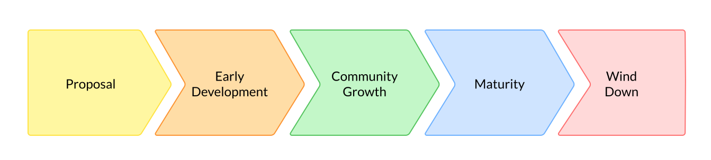

# Chapter 02: Understand Open Source Sustainability and Life Cycle

| Learner personas | - [code contributor](../README.md#code-contributor-)  - [code-adjacent contributor](../README.md#code-adjacent-contributor-)  - [manager/stakeholder](../README.md#managerstakeholder-) |
| ---------------- | --------------------------------------------------------------------------------------------------------------------------------------------------------------------------------------------- |
| Pre-requisites   | [Module 02 - Chapter 01: Why Contribute to Open Source](./01-why-contribute-to-oss.md)                                                                                                        |

- [Chapter 02: Understand Open Source Sustainability and Life Cycle](#chapter-02-understand-open-source-sustainability-and-life-cycle)
  - [Learning Objectives 🧠](#learning-objectives-)
  - [Sustainability ♻️](#sustainability-️)
    - [Corporate Sustainability 101](#corporate-sustainability-101)
    - [🙋🏽‍♀️ Learner Question: Do you know what CZI's software supply chain looks like? How much of that chain is or depends upon free and open source software?](#️-learner-question-do-you-know-what-czis-software-supply-chain-looks-like-how-much-of-that-chain-is-or-depends-upon-free-and-open-source-software)
    - [Integrating OSS in your Sustainability Plan](#integrating-oss-in-your-sustainability-plan)
  - [OSS Project Life Cycle 🌲](#oss-project-life-cycle-)
    - [1. Proposal](#1-proposal)
    - [2. Early development](#2-early-development)
    - [3. Community growth](#3-community-growth)
    - [4. Maturity](#4-maturity)
    - [5. Wind-down](#5-wind-down)
    - [🙋 Learner Question: Which stage of the OSS Life Cycle is napari in?](#-learner-question-which-stage-of-the-oss-life-cycle-is-napari-in)
  - [Resources 📚](#resources-)

## Learning Objectives 🧠

- Understand the importance of corporate sustainability and how it relates to open source software
- Reflect on the role of OSS within your organization's supply chain
- Understand the life cycle of an open source project and how to set up the project for long-term sustainability

## Sustainability ♻️

By definition, open source licenses allow everyone to use, modify, and re-distribute software freely and for any endeavor. Additionally, free and open source software (FOSS) is often cost-free at the point of use or acquisition. Such unrestricted access is why FOSS sits at the core of all primary digital infrastructure tools and innovation initiatives.
Such a heavy reliance on FOSS - across industry, research, academia, and many more - has also increased our demand for those who sustain our digital infrastructure[^1], mainly on a volunteer basis. Hence, it is not uncommon for open-source sustainers to experience burnout, stress, and diminished mental health. Consequently, all interested parties (i.e., corporate, governmental, research, and not-for-profit) must invest in the OSS ecosystem to ensure long-term sustainability.

[^1]: [Roads and bridges by Nadia Eghbal][roads-and-bridges]

### Corporate Sustainability 101

> **Note**
> To discuss OSS sustainability and the role of corporate stakeholders or contributors, it is essential to understand how sustainability plans affect an organization's bottom line and operations.
> The next section provides a brief introduction to corporate sustainability. Though it may seem like a detour from OSS, it is essential to understand your in the overall OSS ecosystem (as a corporate stakeholder or contributor).

In 1983, the United Nations convened a commission to investigate worldwide the environmental and social impact on human development. The commission released ["Our common future: The world commission on Environment and Development" report][common-future], better known as the Brundlant Report, in 1987. This report makes many recommendations to governments and organizations to engage in _sustainable development_; it also is one of the first documents to define sustainability:

> Development that meets the needs of the present without compromising the ability of future generations to meet their own needs.

Which recognizes the need for balance between economy and ecosystem sustainability.
Since then, many organizations have adopted strategies for corporate sustainability. Such strategies drive internal policies and processes around natural resource usage, diversity and inclusion, and fair treatment of employees and external actions, such as the sustainability of their entire supply chain operations and the corporation's impact on the Earth.

A sustainability plan impacts every aspect of an organization's operation and how it engages with, engages with, and impacts external groups. Opening the door for new collaborations, partnerships, innovation, and growth opportunities.
Ultimately, corporate sustainability is a long-term strategy that aims to create value for all stakeholders, including the corporation itself, its employees, customers or users, and the broader community, and [many studies have shown that such a strategy is beneficial for the corporation's bottom line](https://sloanreview.mit.edu/article/sustainability-lessons-from-the-front-lines).
So well-planned and executed corporate sustainability plans can be a significant investment with opportunities for high returns.

However, for organizations that rely upon technology to keep their business running (all of them right now), a significant component is usually left out of their sustainability plan: **the software**.

### 🙋🏽‍♀️ Learner Question: Do you know what CZI's software supply chain looks like? How much of that chain is or depends upon free and open source software?

### Integrating OSS in your Sustainability Plan

If you look carefully at your software supply chain, you will find it heavily depends on free and open source software. If you look deeper, a significant portion of your supply chain relies on the few people who maintain the software you use. From a business perspective, not engaging in OSS sustainability is a significant risk. If the sustainers of a critical piece of digital infrastructure for your organization decide to stop maintaining it (or have to due to burnout), you will have to find an alternative or maintain it yourself. Both options are expensive and time-consuming.

> **Important**
> The above statement does not aim to spread fear, uncertainty, or doubt (a.k.a. FUD). Turning to proprietary software is **not** the best solution. Not only are you unlikely to find a proprietary solution for every piece of software you use, but this software is incredibly expensive, less flexible, leads to vendor lock-in, and is at least as likely to disappear without notice. FOSS still remains the best option from a corporate sustainability perspective.

Unlike proprietary software, OSS enables an organization to take action to ensure that the OSS projects themselves are sustainable.
How do you do that? This is highly dependent on your organization itself, but here are some actions you can take to get started:

1. Identify the most critical OSS within your supply chain.[^2]
2. Identify the sustainability needs of those projects **in collaboration with the community**.
3. Determine how you can help meet those needs and keep engaging with the community.

[^2]: While it would be nice to contribute to every piece of OSS you use, this is unsustainable. It would help if you focused on those vital to your organization's operations or mission, which could enable or hinder your organization's ability to meet its goals.

Looking back at the sustainability definition from the Brundlant report, you'll notice that this can be directly applied to open source projects. Though, most of the sustainability efforts and initiatives launched in the last decade or so focus on the financial (or economic) aspect only and ignore essential areas of the ecosystems such as community health, equality, operations of the entire supply chain, and interested parties' relationship management, among others.
Hence, why one of the most essential actions you can take towards including OSS in your sustainability plan is to engage with the community and understand their needs and what type of support is the most critical for them.

## OSS Project Life Cycle 🌲

Understanding the life cycle of an open source project helps corporate sponsors extend the right kind of support at the right time. Although every project has a unique trajectory, we can outline some common themes which can be used to identify the state and needs of any project.

An OSS project can go through the following stages, but the depth and duration of each stage will vary:

Conversations around sustainability usually start in the [community growth](#3-community-growth) or [maturity](#4-maturity) stage, but it's healthier to consider and work towards sustainability in every stage of the life cycle.

### 1. Proposal

An individual or group identifies a problem that software can solve. They either start a new open source tool from scratch or create an open source equivalent to a proprietary solution.

In this stage, they develop a concrete project proposal by ideating on topics like:

- Scope and goals for the project
- User workflows and comparisons to alternatives
- Software development stack and system architecture
- Development timeline and deliverables
- Resource requirements (contributors and funds)

The project may add more initial authors to the team, look for incubation opportunities, or share the proposal with corporate management to get funds for early development work.

### 2. Early development

The project enters a rapid development phase to achieve the set goals. Teams usually follow an agile approach to development, where they release small-scoped working software and incrementally improve it.

In this stage, initial authors work to:

- Adopt an appropriate OSS license
- Release the first few versions of the project
- Create documentation to onboard new users
- Find early users within the broader community or company
- Author (or adopt) a Code of Conduct and enforcement strategy
- Improve the project quickly based on user feedback

Initial author teams often consist of developers and focus only on quick software development. However, it's equally important to invest in other vital areas like user experience and accessibility features to create solid foundations for the long-term usability of the project.

### 3. Community growth

As the project improves, it attracts more users, followed by more contributors, and eventually, a community begins to develop around the project.

In this stage, contributor teams:

- Set up community forums and community governance models
- Work on community engagement strategies to support the community
- Promote the project broadly at conferences, podcasts, newsletters, and more
- Expand and update the community documentation, especially for various kinds of contributors
- Continue to improve the project based on community feedback
- Continue to make releases in quick succession
- Focus on certain maintenance activities in addition to enhancement tasks

Projects can aim to create a welcoming environment for everyone and work with the community to review and update the roadmap regularly.

### 4. Maturity

The project reaches a steady state of growth with a dedicated community.

In this stage, the project has:

- A linear or plateaued community growth
- Advocates for the project outside the immediate community
- A regular release cadence and release process
- Several active downstream projects
- Maintenance prioritized over feature development

Initial authors and early maintainers can develop symptoms of burnout if the project's contributor community is not healthy. Projects may also look towards financial sustainability options like grants or paid licenses in this stage.

### 5. Wind-down

The project will eventually experience community stagnation or decline. This can happen after years or even decades for reasons including a newer & faster alternative, user base saturation, or sustainer team burnout.

In this stage, the project winds down activity and decides to archive, shut down, or transfer the project to a different space for continued maintenance. The team also:

- Updates the project repository, documentation, forums, and more to indicate the decreased activity and direct new users to alternative spaces
- Works with the community for a graceful transition without major disruptions

It isn't easy to recognize when a project has stalled and needs to wind down, but it's essential for the sustainability of the broader OSS ecosystem. An explicit decision helps the community adopt better tools and smoothly direct their contribution efforts to other growing projects.
We'll discuss strategies and best practices for winding down in Module 3.

### 🙋 Learner Question: Which stage of the OSS Life Cycle is napari in?

napari is being continuously improved and maintained, and several (new and existing) users and contributors are actively participating in the project. Therefore, it's in the **community growth** stage. 😉

## Resources 📚

- [The Life Cycles of Open Source Projects, by The Linux Foundation](https://lfx.linuxfoundation.org/blog/the-life-cycles-of-open-source-projects/)
- [Understanding the open source software life cycle, by Red Hat](https://www.redhat.com/en/resources/open-source-software-life-cycle-brief)
- [Roads and Bridges: The Unseen Labor Behind Our Digital Infrastructure, by Nadia Eghbal](https://www.fordfoundation.org/work/learning/research-reports/roads-and-bridges-the-unseen-labor-behind-our-digital-infrastructure/)
- [Sustainable Open Source, by OSS Watch](http://oss-watch.ac.uk/resources/sustainableopensource)
- [The Brundlant report][common-future]

<!-- Reusable links -->

[roads-and-bridges]: https://www.fordfoundation.org/work/learning/research-reports/roads-and-bridges-the-unseen-labor-behind-our-digital-infrastructure/
[common-future]: https://en.wikipedia.org/wiki/our_common_future
