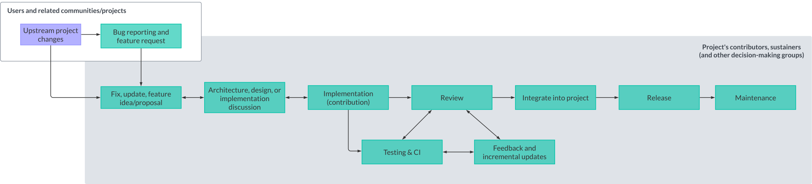

| Learner personas | - [code contributor](../README.md#code-contributor-)  - [code-adjacent contributor](../README.md#code-adjacent-contributor-)                                                                                                                                                |
| ---------------- | ------------------------------------------------------------------------------------------------------------------------------------------------------------------------------------------------------------------------------------------------------------------------------ |
| Pre-requisites   | - [Module 01: Introduction to Open Source](../01-intro-to-os/)  - [Chapter 2.1: Why and how to contribute to Open Source](./01-why-contributing-to-oss.md)  - [Chapter 2.2: Understand Open Source Sustainability and Life Cycle](./02-understand-oss-sustainability.md) |

# Chapter 03: Contributing to open source

## Table of Contents 🗂️

- [Chapter 03: Contributing to open source](#chapter-03-contributing-to-open-source)
  - [Table of Contents 🗂️](#table-of-contents-️)
  - [Learning Objectives 🧠](#learning-objectives-)
  - [Contribution tips and best practices 🔖](#contribution-tips-and-best-practices-)
    - [How contributions work 🎁](#how-contributions-work-)
    - [Contributions beyond code ✨](#contributions-beyond-code-)
  - [Development and maintenance considerations 💻](#development-and-maintenance-considerations-)
    - [The OSS Way](#the-oss-way)
    - [Designing in the open](#designing-in-the-open)
  - [Working with large distributed teams 🌎](#working-with-large-distributed-teams-)
  - [Tools 🛠](#tools-)
  - [Resources 📚](#resources-)
  - [Continue learning 🚥](#continue-learning-)

## Learning Objectives 🧠

<!-- TODO: update as content is added -->

- Learn more about how to best approach open source contributions
- Learn about valuable tools and practices for open source contributions and project management

## Contribution tips and best practices 🔖

### How contributions work 🎁

For any open source project, one of the most challenging tasks for a new contributor is identifying ways to get involved by making online contributions to propose appropriate changes. Contribution processes vary depending on the open source project, its governance model, and the type of contribution you want to make. For example:

- Projects have different guidelines covering coding style, documentation style, testing, release, versioning, Pull/Merge Requests, issues, triaging, and more.
- Some projects require all contributors to sign contributor license agreements (CLAs), while others have signed-off-by or other processes.
- Some projects have a defined team of core developers or maintainers. In contrast, others follow a federated model or are organized via Working Groups/Special Interest Groups responsible for different project areas.

These are only a few ways that the contribution style might differ, so it is paramount that you familiarize yourself with the project's contribution guidelines and processes before you start contributing.

> **Note**
> We will cover community guidelines in more detail in the next chapter.

In general, an open source project allows any individual to make contributions in the form of [issues](https://help.github.com/en/github/managing-your-work-on-github/about-issues) or [Pull Requests](https://help.github.com/en/github/collaborating-with-issues-and-pull-requests/about-pull-requests)(called Merge Requests in GitLab). Community members can also perform [reviews](https://help.github.com/en/github/collaborating-with-issues-and-pull-requests/about-pull-request-reviews) and provide feedback or suggestions through [comments](https://help.github.com/en/github/collaborating-with-issues-and-pull-requests/commenting-on-a-pull-request) on the ideas and changes which they or others have suggested. This exchange of ideas leads to a better quality of resources that are developed collaboratively and bring new perspectives regarding a particular feature.

The diagram below shows a typical workflow for code contributions to an open source project. While many projects follow this workflow, others might have additional steps or different ways of handling contributions.

 Start -> identify if there is an issue or create one -> assign issue -> make and push changes -> open PR and wait for review -> address feedback cycles -> ending contribution in merge or reject and close" width="500px">

> **Note**
> As you can see, the outcome of a contribution could be getting your contribution merged or rejected.

It is important to remember that the outcome of a contribution is not a reflection of your skills or abilities. It reflects the project's needs and priorities at that time. There are loads of factors that need to be considered by a sustainer when reviewing and approving contributions: maintainability, security, performance, scalability, upstream and downstream compatibility, and more.

### Contributions beyond code ✨

Not all contributions to an open source project will be made in the form of code.
Open source projects also need contributions in documentation, design, marketing, community management, fundraising, legal counsel, accessibility auditing and remediation work, translation and localization, and more. These contributions are as significant as code contributions and are often called code-adjacent contributions.

While some of these contributions _might_ follow a similar workflow to code contributions, others might not. For example, a contribution to the documentation of a project might follow the Pull Request workflow described above. However, community-related contributions such as organizing community meetings or mentoring new contributors follow different processes.

As discussed in [Chapter 02](./02-understand-oss-sustainability.md), a project's sustainability requires collective actions across multiple areas; thus including and acknowledging all types of contributions is paramount for the success of an open source project. This starts with creating no-code/code-adjacent contribution pathways to adopt mechanisms to make these contributions visible and valued.

> **Tip**
> GitHub only makes certain types of contributions visible, while many other vital contributions are obscured or not accounted for.
> You can consider adding the [all contributors bot][all-contributors] to your projects to ensure everyone gets credit for their contributions.

👉🏽 The Turing Way has a [dedicated section on their contribution guidelines for recognizing contributions using the "all contributors" bot][turing-contributions].

## Development and maintenance considerations 💻

Let's start by revising a popular product-focused software development lifecycle: the Agile lifecycle.

The Agile methodology has gained tremendous popularity, enabling development teams to iterate on and ship new products and features efficiently and with consistent throughput.
However, these practices are best suited for "traditional tech corporate" (including startups and some not-for-profit) due to the following assumptions/processes involved:

- Assumes a dedicated team of developers, designers, and project/product management (and other roles) is working on the project.
- There is often a clear distinction between the development team and the product's end-users.
- There is a project manager, and often a project owner, who is responsible for determining the scope of work, prioritizing tasks, and ensuring the team meets its deadlines.
- Product goals are often tied to business goals and are measured by revenue, user growth, ROI, and more metrics.
- Depending on the licensing and revenue generation model, the organization might also be responsible for providing support to end-users and have an SLA (Service License Agreement).
- Even if using open source tools or software to build the ultimate product, the product itself may or might not be open source. Thus, the ultimate decision-maker will is the product owner; no consent or consensus is sought.
- Due to the time and delivery expectations, this isn't easy to implement with a fully geographically-distributed team that communicates asynchronously.

### The OSS Way

In contrast, open source projects are often developed and maintained by a community of volunteers and/or paid contributors. There is an overlap between community members and end-users[^1] of the project, and both are involved in the development and maintenance of the project. The community members are also responsible for the project's governance and decision-making processes.

[^1]: Depending on how a project defines the boundaries of their community - and community members - users might be included in such definition of community or counted as a group of individuals interacting with the project from a more transactional or utilitarian perspective. Both are valid perspectives. However, such definitions will impact how the project is developed and maintained.

In contrast to the Agile methodology, the OSS development cycle can be slower and centered around collaboration and co-ownership, as contributions can often lead to longer-term implications in terms of maintenance for the project and other projects that depend on it.

The development cycle is often driven by the community's needs and priorities, and the project's goals are often tied to the community's goals and values and roughly follow the steps in the schematic below.

While not exhaustive, here is a list of core characteristics and differentiators of OSS development (vs. other product methodologies such as Agile or [Waterfall](./images/waterfall-swe.svg)):

- The process is designed for geographically distributed teams and asynchronous communication.
- OSS maintenance and development is based on transparency, trust, collaboration, and co-ownership.
- Relies on distributed decision-making and consensus-seeking.
- It's decentralized and community-driven nature requires an extra focus on transparency.
- Contributions are peer-reviewed.
- End-users and community members equally provide feedback, raise bugs, and request features.
- The project's goals are tied to the community's goals and values.
- Operate through processes designed to be resilient to organizational change and allow for self-organization and self-management.
- While projects usually have a release cadence, deadlines are rarely set in stone, and a significant release might be delayed if there are blockers or the community needs more time to review and test the release. Equally, many releases do not include new features but are focused on bug fixes, documentation, and maintenance tasks (e.g., CI, dependencies updates, testing).
- The development model can scale (up and down) depending on community participation and maintainers' availability.
- Trust is built by past record of productive participation and wise decisions on smaller issues.
- A common mantra in OSS is "Release Early, Release Often" (you can refer to the schematic above).
  While this approach allow users and maintainers alike to benefit from new features and critical patches at a reasonable pace.

### Designing in the open

While talking about the OSS development cycle, it is essential to highlight the importance of designing in the open.

Some best practices for designing in the open include:

- Communicate early and often on the project’s preferred communication platform.
- Anticipate feedback and proactively provide context and rationale for your design decisions.
- Acknowledge given feedback and re-work your contribution.
- Signal willingness to adapt your design if someone else is willing to collaborate with you.
- Plan for modularity, even if the first designs are not modular.

Following these best practices will help you build trust and get effective acceptance of your design decisions and ideas. Important things to consider when designing for acceptance are:

- Design your contribution to be as modular and as straightforward to implement as possible.
  - Small, well-scoped contributions are easier to review and to integrate.
  - Modular contributions are easier to maintain and update.
  - Iterative development practices promote extensibility.
- Scope and divide as needed.
  - If your contribution is too big, consider breaking it down into smaller, more manageable pieces. Larger changes are more likely to be completed and accepted as a series of smaller changes with concrete goals.
  - Communicate your plans and intentions before you start working on a contribution.

## Working with large distributed teams 🌎

<!-- TODO -->

## Tools 🛠

- [All contributors bot][all-contributors]

## Resources 📚

## Continue learning 🚥

⬅️ **[Previous Chapter: 02 Understand Open Source Sustainability and Life Cycle](./02-understand-oss-sustainability.md)** | **[Next Chapter: 04 Being a Good OS Citizen as a corporate sponsor](./04-good-corporate-oss-citizen.md)** ➡

<!-- Reusable links -->

[all-contributors]: https://allcontributors.org/docs/en/bot/overview
[turing-contributions]: https://github.com/alan-turing-institute/the-turing-way/blob/main/CONTRIBUTING.md#recognising-contributions
