| Learner personas | - [code contributor](../README.md#code-contributor-)  - [code-adjacent contributor](../README.md#code-adjacent-contributor-)                              |
| ---------------- | ------------------------------------------------------------------------------------------------------------------------------------------------------------ |
| Pre-requisites   | - [Module 01: Introduction to Open Source](../01-intro-to-os/)  - [Chapter 01: Why and how to contribute to Open Source](./01-why-contributing-to-oss.md) |

# Chapter 03: Contributing to open source

## Table of Contents 🗂️

- [Chapter 03: Contributing to open source](#chapter-03-contributing-to-open-source)
  - [Table of Contents 🗂️](#table-of-contents-️)
  - [Learning Objectives 🧠](#learning-objectives-)
  - [How contributions work 🎁](#how-contributions-work-)
    - [Contributions beyond code ✨](#contributions-beyond-code-)
  - [Legal and governance considerations](#legal-and-governance-considerations)
  - [Technical considerations](#technical-considerations)
  - [Tools for PM](#tools-for-pm)
  - [Resources 📚](#resources-)
    - [Tools 🛠](#tools-)
  - [Continue learning 🚥](#continue-learning-)

## Learning Objectives 🧠

<!-- TODO: update as content is added -->

- Learn more about how to best approach open source contributions
- Learn about valuable tools and practices for open source contributions and project management

## How contributions work 🎁

For any open source project, one of the most challenging tasks for a new contributor is identifying ways to get involved by making online contributions to propose appropriate changes. Contribution processes vary depending on the open source project, its governance model, and the type of contribution you want to make. For example:

- Projects have different guidelines covering coding style, documentation style, testing, release, versioning, Pull/Merge Requests, issues, triaging, and more.
- Some projects require all contributors to sign contributor license agreements (CLAs), while others have signed-off-by or other processes.
- Some projects have a defined team of core developers or maintainers. In contrast, others follow a federated model or are organized via Working Groups/Special Interest Groups responsible for different project areas.

These are only a few ways that the contribution style might differ, so it is paramount that you familiarize yourself with the project's contribution guidelines and processes before you start contributing.

> **Note**
> We will cover community guidelines in more detail in the next chapter.

In general, an open source project allows any individual to make contributions in the form of [issues](https://help.github.com/en/github/managing-your-work-on-github/about-issues) or [Pull Requests](https://help.github.com/en/github/collaborating-with-issues-and-pull-requests/about-pull-requests)(called Merge Requests in GitLab). Community members can also perform [reviews](https://help.github.com/en/github/collaborating-with-issues-and-pull-requests/about-pull-request-reviews) and provide feedback or suggestions through [comments](https://help.github.com/en/github/collaborating-with-issues-and-pull-requests/commenting-on-a-pull-request) on the ideas and changes which they or others have suggested. This exchange of ideas leads to a better quality of resources that are developed collaboratively and bring new perspectives regarding a particular feature.

The diagram below shows a typical workflow for code contributions to an open source project. While many projects follow this workflow, others might have additional steps or different ways of handling contributions.

```mermaid
%%{
  init: {
    'theme': 'base',
    'themeVariables': {
      'primaryColor': '#7A82E4',
      'primaryTextColor': '#000',
      'primaryBorderColor': '#7A82E4',
      'lineColor': '#617388',
      'secondaryColor': '#409D44'
    }
  }
}%%
flowchart TD
  accTitle: "Workflow diagram for code contributions to an open source project"
  start["Start contribution"]
  start --> issue{"Is there
  an issue?"}
  issue --> |Yes| assign["Let others know you
  will work on it"]
  assign --> fixIssue["Clone repo
    and create branch"]
  issue --> |No| createIssue["Create issue"]
  createIssue --> assign
  fixIssue --> makeChanges["Make and push
    changes"]
  makeChanges --> createPR["Create PR and
  mark as ready"]
  createPR --> review["Wait for a review"]
  review --> feedback["Address feedback
  and make changes
  (if needed)"]
  feedback --> |"Might need a
  few cycles"| review
  feedback --> |"Approved ✅"| merge["Merge PR"]
  feedback --> |"Rejected ⛔️"| close["Close PR
  without merge"]
  merge --> fin["End contribution"]
  close --> fin
```

> **Note**
> As you can see, the outcome of a contribution could be getting your contribution merged or rejected.

It is important to remember that the outcome of a contribution is not a reflection of your skills or abilities. It reflects the project's needs and priorities at that time. There are loads of factors that need to be taken into account by a sustainer when reviewing and approving contributions; some of them are: maintainability, security, performance, scalability, upstream and downstream compatibility, and more.

### Contributions beyond code ✨

Not all contributions to an open source project will be made in the form of code.
Open source projects also need contributions in the form of documentation, design, marketing, community management, fundraising, legal counsel, accessibility auditing and remediation work, translation and localization, and more. These contributions are as important as code contributions and are often called code-adjacent contributions.

While some of these contributions _might_ follow a similar workflow to code contributions, others might not. For example, a contribution to the documentation of a project might follow the Pull Request workflow described above. However, community-related contributions such as organizing community meetings or mentoring new contributors follow different processes.

<!-- TODO: add link to sustainability section -->

As discussed in Chapter 02, a project's sustainability requires collective actions across multiple areas; thus including and acknowledging all types of contributions is paramount for the success of an open source project. This starts with creating no-code/code-adjacent contribution pathways to adopt mechanisms to make these contributions visible and valued.

> **Tip**
> GitHub only makes certain types of contributions visible, while many other vital types of contributions are obscured or not accounted for.
> You can consider adding the [all contributors bot][all-contributors] to your projects to ensure everyone gets credit for their contributions.

## Legal and governance considerations

## Technical considerations

## Tools for PM

## Resources 📚

### Tools 🛠

- [All contributors bot][all-contributors]

## Continue learning 🚥

⬅️ **[Previous Chapter: 02 How to be a good corporate citizen?](./02-good-corporate-oss-citizen.md)** | **[Module activity: OSS career journey](./OSS-journey-activity.md)** ➡️

<!-- Reusable links -->

[all-contributors]: https://allcontributors.org/docs/en/bot/overview
