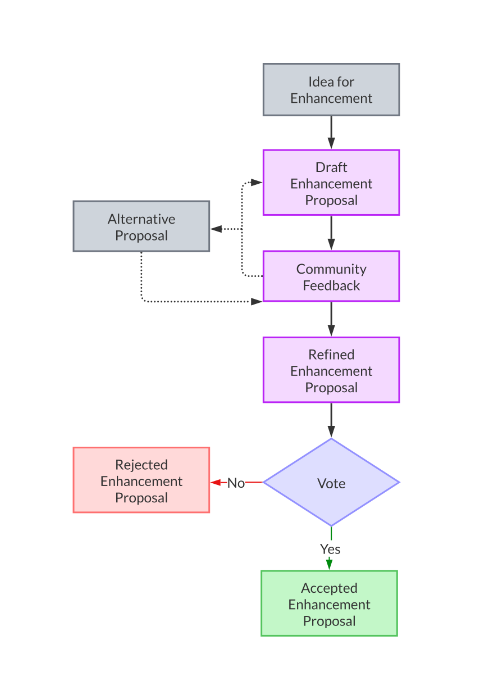

| Learner personas | - [code contributor](../README.md#code-contributor-)  - [code-adjacent contributor](../README.md#code-adjacent-contributor-)  - [manager/stakeholder](../README.md#managerstakeholder-) |
| ---------------- | --------------------------------------------------------------------------------------------------------------------------------------------------------------------------------------------- |
| Pre-requisites   | - [Module 01: Introduction to Open Source](../01-intro-to-os/)  - [Chapter 2.1: Why and how to contribute to Open Source](./01-why-contributing-to-oss.md)                                 |

# Chapter 04: Being a Good Open Source Citizen as a Corporate Contributor

- [Chapter 04: Being a Good Open Source Citizen as a Corporate Contributor](#chapter-04-being-a-good-open-source-citizen-as-a-corporate-contributor)
  - [Learning Objectives 🧠](#learning-objectives-)
  - [What does it mean for an organization to contribute to open source? 🤔](#what-does-it-mean-for-an-organization-to-contribute-to-open-source-)
  - [Familiarize with Community Standards 📖](#familiarize-with-community-standards-)
    - [(New) Contributor guidelines](#new-contributor-guidelines)
    - [Communication guidelines](#communication-guidelines)
    - [Maintenance guidelines](#maintenance-guidelines)
    - [Governance](#governance)
    - [Roadmap](#roadmap)
  - [Building Community Consensus 🤝](#building-community-consensus-)
    - [Organizational Open Source Strategy](#organizational-open-source-strategy)
    - [Considerations for Small-Scope Contributions](#considerations-for-small-scope-contributions)
    - [Steps for Large-Scoped Tasks](#steps-for-large-scoped-tasks)
  - [Turn Private Conversations into Public Resources 💬](#turn-private-conversations-into-public-resources-)
    - [Pre-requisites and assumptions 🧰](#pre-requisites-and-assumptions-)
    - [The Process 📜](#the-process-)
      - [Setup](#setup)
      - [Consent and credit](#consent-and-credit)
      - [Loop back with participants](#loop-back-with-participants)
      - [Share with the community](#share-with-the-community)
    - [Tips for transparent communication 💡](#tips-for-transparent-communication-)
  - [Examples of Good Corporate Open Source Contributions 🖼️](#examples-of-good-corporate-open-source-contributions-️)
    - [CPython Developer-in-Residence Program (PSF Sponsors: Google, Bloomberg, and Meta)](#cpython-developer-in-residence-program-psf-sponsors-google-bloomberg-and-meta)
    - [Faster CPython Initiative (Microsoft)](#faster-cpython-initiative-microsoft)
    - [Open Sourcing Memray (Bloomberg)](#open-sourcing-memray-bloomberg)
    - [Consulting with Open Source Projects (Quansight)](#consulting-with-open-source-projects-quansight)
  - [Resources 📚](#resources-)
  - [Continue learning 🚥](#continue-learning-)

## Learning Objectives 🧠

- Learn best practices for successful corporate sponsorship and effective collaboration with the project community
- Understand when and how to create new open source projects vs when to contribute to existing ones.

## What does it mean for an organization to contribute to open source? 🤔

In this chapter, we will explore what it means for an organization to contribute to open source and how to build a contribution model that is impactful for both the organization and the open source project.

Historically, the relationship between some open source projects and organizations that use OSS has been shaky.
This is partly due to how organizations build business relationships, which are not always aligned with or work for open source projects and communities, so some organizations struggle to find productive and impactful ways to contribute to open source. Another source of friction arises when the organization's needs and motivations to participate in open source are not aligned with or communicated to the project and their community. In those cases, the organization can often be perceived as self-serving, and it might struggle to establish trust within the open-source community.

However, some success cases exist in which organizations and open source projects have established fruitful and long-term relationships. We will provide some [examples of impactful corporate engagements later in this chapter](#examples-of-good-corporate-open-source-contributions-️).

A typical contribution pattern adopted by organizations is to give employees a substantial amount of their contractual time to participate in open source projects. While this might seem a low-friction approach, it is essential that said employees familiarize themselves with the contribution processes and norms within that project and its community.

> **Note** > [Chapter 2.4.](../02-participating-in-oss/04-contributing-tips.md) covers many contribution best practices that apply to both individual and corporate contributors.

## Familiarize with Community Standards 📖

All open source contributions start with understanding project-specific community standards and processes. This first step is crucial for corporate contributors, who might encounter additional challenges in building a reputation and trust within the project community (vs. an individual contributor)[^1]. Taking the time to understand community standards early and actively follow them signals a strong respect for volunteers' time and the community.

[^1]: While this might not always be true, many open source projects are extra cautious when engaging with corporate contributors due to a lack of understanding of their motivations or for fear of a corporate takeover.

These standards are usually available in the project's documentation under the community, developer, or contributor sections. Corporate-sponsored individual contributors should familiarize themselves with the following non-exhaustive set of guidelines.

> **Important**
> Some of the most important documents to read are the project's Code of Conduct, Contributor Guidelines, Governance or Leadership Structure, and the LICENSE file. The following sections provide a glimpse of the information in these documents.

### (New) Contributor guidelines

In this document, you will find information regarding the journey, tasks, and tools for your first few successful contributions, including:

- End-to-end contribution workflow for the project and specific requirements like corresponding issues for all pull requests, a `CHANGELOG` entry for each pull request (PR), and more
- Guidelines for creating context-rich issues & PRs and the appropriate process to move the discussions forward, for example, by notifying a particular project team
- Instructions for setting up local or personal development environments, documentation systems, and test infrastructure, along with project-specific helper tools like `pre-commit.`
- Style guides, i.e., project-specific preferences, for authoring code, writing documentation, and using design elements

> **Note:**
> This step can also involve signing a CLA, in which case you should check in with your management and legal teams.

### Communication guidelines

Best practices for engaging with fellow community members include:

- Various community forums and their primary purpose, like support questions, developer discussions, etc.
- Guidelines for good asynchronous communication, for example, adding relevant context, asking specific questions, using jargon-free plain language, expected time to respond, etc.
- Code of Conduct to follow in the community spaces

### Maintenance guidelines

Pathways to becoming active and regular contributors by engaging in project maintenance activities, including:

- Issue triaging and PR reviewing guidelines, for example, using project labels or bots
- Release procedure and cadence
- Continuous integration / Continuous Deployment (CI/CD) workflows
- Guidelines for upstream and downstream collaboration
- Instructions for supporting project management, community engagement, etc.

### Governance

Decision-making standards and workflows, including:

- Guidelines for creating and discussing Enhancement Proposals
- Recorded project leadership structure, particular interests or working groups, member roles and responsibilities, and more

> **Tip:**
> Learn more about open source governance in [Module 1](../01-intro-to-os/03-understand-oss-governance.md).

### Roadmap

While having a roadmap helps determine priorities and the project's direction, many projects do not have a detailed roadmap. Some projects use other alignment methods, such as Enhancement Proposals (CPython, NumPy, napari, Jupyter), while others use their issue tracker and release milestones.

A roadmap usually contains the project's current priorities, and future direction is decided with input from the community. If the project has a roadmap, it is a good idea to go through the contents of it. Such a document can often provide valuable information about topics the community care about and the direction of the project. It can also help you identify areas where you can contribute as a corporate contributor.

## Building Community Consensus 🤝

Corporate-backed open source contributors have the expertise and resources to work on large-scoped tasks and can significantly impact the project. A vital component of this work is building consensus within the community on the design and implementation of these tasks at each stage of your participation: org-level open source strategy, team-level sprint planning, and day-to-day individual contributions.

> **Note**
> A good rule of thumb is that funding or significant investment, such as in-kind donations, should follow the community, not the other way around.

### Organizational Open Source Strategy

Effective open source collaboration trickles down from the leadership teams. It's easier for individual contributors to build consensus within the community if:

- The proposed tasks are aligned with the open source project's roadmap
- There's transparency around the corporate interest in the task of building community trust
- Corporate contributors contribute to general maintenance efforts regularly, allowing volunteers to participate in the task-specific decisions

### Considerations for Small-Scope Contributions

Building consensus is also essential for day-to-day contributions involving fewer stakeholders and a self-driven process. It helps you build trust within the community and make impactful contributions. Some general best practices for thoughtful contributions include:

- Before complete implementations, discuss potential solutions on the issue tracker and open draft PRs for in-depth discussions when necessary
- Actively seek code reviews or alternative feedback mechanisms for non-code contributions
- Always consider the security, maintenance, and community implications of your work and discuss any concerns on contributor forums

### Steps for Large-Scoped Tasks

Decisions about minor fixes and scoped features can often be made as part of a project's contribution workflow. However, when discussing large-scoped tasks that touch several project parts, impact a substantial user base, or significantly change the project's architecture, behavior governance, and community workflows, that streamlined process is no longer suitable. Such significant decisions require more robust decision-making processes where the interested and impacted parties can show their support, hesitations, ask questions, and align towards a path for implementation, or even reject the proposal. Community-governed projects usually have an Enhancement Proposal or Request for Discussion mechanism for such cases:

  

This process aims to build consensus within the community on the task's design and implementation, considering the short, mid, and long-term implications of such a change. This process also helps provide a transparent and inclusive decision-making process.

When working on enhancement proposals:

- Write the proposal following proper guidelines with all the relevant background and details like implementation plan, alternative strategies, community impact, anticipated challenges, etc.
- Work with 1-2 community members on the draft before submitting for broader community feedback. This will ensure you are focusing on the right problem for the community and signals a willingness to collaborate
- Keep an open mind for community feedback and address the questions and concerns thoughtfully
- Make appropriate updates to your proposal based on the community feedback and request a vote only when confident
- Note that sometimes the best strategy to incorporate feedback could be to withdraw the proposal and write a fresh one
- Do not take a rejection personally, but understand the rationale and work with the community on a different plan

> **Important**
> This community decision-making and differing points of view are how we keep up the quality of our open source projects, so be patient and remember the human behind the screens even when the conversations get difficult. 😊

## Turn Private Conversations into Public Resources 💬

Suppose you and your team are participating in OSS as a corporate sponsor. In that case, you might have already identified ways in which OSS development differs from some of your internal practices (for a refresher, check [Chapter 2.04](./04-contributing-tips.md)).

You might encounter that one of the earliest points of friction is the difference in how internal vs. community consent-based communications happen, and it can be tricky to identify the right balance between the two.

This section provides guidelines and a checklist for you and your team to practice and improve your communication skills in the open.

### Pre-requisites and assumptions 🧰

Before continuing, ensure the following assumptions apply to your team. Some might not apply to your team, and that's ok. The goal is to identify the applicable ones and adjust the ones that are not.

- [ ] Your private conversations are transcribed (or can be) or documented (perhaps through internal agenda documents).
- [ ] You are starting from a place of trust. If you are approaching the project and thus building trust, or if you have, unfortunately, broken this trust, then you'll need to address this lack of trust. The proposed process will help you strengthen trust but will not fix it alone.
- [ ] You know and understand your community's guidelines (or why none exist).

### The Process 📜

We break the process of making conversations public into smaller subsections depending on the tasks involved. Each step has a set of guidelines and a checklist to help you and your team practice and improve your communication skills in the open.

This process is designed to incorporate various private conversations, including everyday chat on internal forums, email threads, online/video meetings, and more. You can scope the process to match the scale and purpose of your private discussion.

> **Important**
> All these steps can be done **after** the conversation/call. However, we recommend you prepare and communicate your intention **before** the conversation/call. This will help you and your team be more intentional about the conversation and the notes you take.

#### Setup

- [ ] Create a shareable, linkable record of the conversation or meeting and share it only with members involved. This can be a Google Doc, a Hackmd file, or an Etherpad link. Once the document is created, you can transcribe/add the notes and actions from your conversation.
- [ ] Ensure you have a record of everyone that attended or participated in the discussion. We recommend capturing the individual's name and GitHub/GitLab username. This will help you identify who said what and who to tag in the conversation.
- [ ] Tell people what you are going to do. This can be done in various ways, but the goal is to keep everyone aligned. If the private conversation you want to make public is specific to a subset of the community (i.e., people who attended particular events), tell them first, then say to the rest of the community.

#### Consent and credit

> **Important**
> This is a crucial step to build trust with conversation participants.
> If you have decided that the conversation will be shared, make it explicit and get individuals' consent. The next steps assume you've done this.

- [ ] Grab a copy of the [Template: Asking for consent](./templates/ask_for_consent.md) and fill it out with the relevant information. The goal is to explain what you plan to do, ask for their consent, allow them to review the draft document, and explain what is expected of them.
- [ ] Send the message to everyone who participated in the conversation.
- [ ] Record responses as they come in.

#### Loop back with participants

- [ ] Update the document based on participants' consent responses by anonymizing some people, omitting content, or both.
- [ ] Share the resource with everyone who participated in the conversation. At this point, you want to focus on: adequate credit and provide a precise deadline for feedback. You can use the [Template: Loop back](./templates/loop_back.md) to share a link to the updated document.
  > **Warning**
  > Some people might want to change their credit preferences at this stage. Be prepared to accommodate these changes.
- [ ] Incorporate any suggestions or feedback.

#### Share with the community

Before you publish and share your resource with the world:

- [ ] Give all the contributors a heads-up that this will be published soon.
- [ ] Publish and share with the rest of the community.

### Tips for transparent communication 💡

You can adopt one or more of the transparent workflows mentioned in this section to manage your team's open source contributions.

Corporate organizations usually have strict public communication policies for security, liability, intellectual property, and public relations reasons. This is why we have a corporate-friendly [process](#the-process-) described above. Suppose you want a more significant impact and establish a solid open source practice. In that case, it is worth considering an organizational discussion to relax some policies for the scope of your open source work. Taking it a step further, you can set up an Open Source Program Office (OSPO) that creates and enforces guidelines for your open source participation that work for corporate security and open source communities.

> **Important**
> Ensure that each of the following stakeholders is comfortable with the open workflow before implementing it:
>
> - your organization (leadership/management)
> - contributing team members
> - open source project community members
>   You can use a variation of the [consent-seeking approach](#consent-and-credit) mentioned above for this.

- **Project management:**
  - Use tools familiar to the community like a public GitLab or [GitHub project board](https://docs.github.com/en/issues/planning-and-tracking-with-projects/learning-about-projects/about-projects) for tracking and managing your organization's OSS contributions.
  - Set up new public versions of your internal project management tool and share it with the broader community. This allows your team to feel comfortable using the tool while providing community members visibility into your open source work.
  - Open the OSS-specific parts of your internal project management tool (like a single Kanban board) to the public and share it with the community.
- **Synchronous meetings:**
  - Open the OSS-contribution-related meetings to the project's wider contributor community. You can have separate, additional internal meetings to discuss confidential topics.
  - Take meeting notes on a public platform like HackMD workspace or public Google Doc shared with the community. If the meeting is private, you can omit confidential topics from the notes and share the rest by default.
  - The project community might already have preferred public meeting & note-taking platforms that you can adopt for your team's OSS contribution meetings.
  - You can also discuss with the community to join some existing community meetings and expand their scope to include topics your team is interested in.
- **Asynchronous discussions:**
  - Gently nudge your team members to cross-post any privately shared and relevant insights, observations, or quick discussions on the OSS project's issue tracker. They can add comments to an existing issue or open new ones.
  - Onboard your team to the community's preferred contributor discussion forum. Your team can use the existing channels (and follow the [community guidelines](#communication-guidelines)) for project-related communication. Alternatively, you can discuss with the community and create a new public channel on the forum for your team to collaborate.
  - Set up automation to "bridge" communication between a community space and your team's internal communication tool. For example, a configurable bot can cross-post comments between a private Slack channel and public Discourse forum.

## Examples of Good Corporate Open Source Contributions 🖼️

There is no universal formula for successful corporate open source partnerships. We need several innovative contribution approaches to improve the overall open source sustainability journey. If you adhere to the best practices in this chapter and generally practice the open source ethos, you can create an excellent open source plan for your organization.

The following are examples of corporations being good open source citizens in their sponsorship, selected from within the Python community.

### CPython Developer-in-Residence Program (PSF Sponsors: Google, Bloomberg, and Meta)

One of the biggest success stories in the Python community is the [Python Software Foundation's (PSF)](https://www.python.org/psf-landing/) Developer in Residence (DIR)program. PSF is a non-profit organization that supports the Python language and community. Corporate organizations can directly sponsor the PSF, and the PSF staff members, with advice from the elected board of directors, decide the best ways to use the funds.

The DIR program employs a developer for full-time hours with competitive pay to contribute to CPython and support the volunteer Python community. This is an expensive and ambitious program, and financial sponsorship provided at a "visionary" level by Google, Bloomberg, and Meta allows for such no-strings-attached programs.

> The PSF and the Steering Council summarize the expected responsibilities of the DIR as follows:
>
> - addressing PR and issue backlog,
> - analytical research to understand the project's volunteer hours and funding,
> - investigation of project priorities and their tasks going forward,
> - and working on those priorities.
>
> ~ [I am the new CPython Developer in Residence, by Łukasz Langa](https://lukasz.langa.pl/a072a74b-19d7-41ff-a294-e6b1319fdb6e/)

This program has been running strong for over two years and has expanded to include a [Security DIR](https://pyfound.blogspot.com/2023/06/announcing-our-new-security-developer.html) and [Deputy CPython DIR](https://lukasz.langa.pl/40b601fc-2b24-4629-91d9-3b32c58365c6/).

### Faster CPython Initiative (Microsoft)

This is an ongoing initiative sponsored by Microsoft[^2] to speed up CPython - the reference implementation of the Python Programming Language. Microsoft employs a developer team led by Guido van Rossum, the creator of Python and a CPython core developer, to work with the Python community to ideate, prototype, and implement features that will improve Python's performance.

This team includes long-term contributors to CPython and other Python libraries who understand the community workflows, priorities, and decision-making. They actively contribute to maintenance tasks and work on activities that benefit the entire community.

> [Michael] Droettboom says he hopes they [volunteer core devs] don't feel "overloaded" and works to take off "some of that burden." "We've kind of created a little more burden on those people. So it's only fair that we also ask what we can do to help."
>
> ~ [A Team at Microsoft is Helping Make Python Faster, by Jay Miller](https://devblogs.microsoft.com/python/python-311-faster-cpython-team/)

[^2]: [Faster CPython by Guido van Rossum, at Python Language Summit 2021](https://github.com/faster-cpython/ideas/blob/main/FasterCPythonDark.pdf)

### Open Sourcing Memray (Bloomberg)

Bloomberg released an internally-developed tool, Memray - a memory profiler for Python, under an OSI-approved open source license to share the project with the broader Python community. It's a powerful and valuable library that garnered a lot of community attention and immediate adoption. Although Bloomberg employees remain the primary maintainers, the team enables and supports community contributors.

> We also encourage the community to help us shape the future and direction of the tool by letting us know what specific problems they are facing and how we could extend or modify our tool to solve them. In addition, we hope that contributors will help us add new reporters that adapt to problems that we have not yet considered and that they extend the tool to work on systems that we have not initially supported.
>
> ~ [Bloomberg publishes Memray, a new open source memory profiler for Python code](https://www.bloomberg.com/company/stories/bloomberg-memray-open-source-profiler-python-code/)

### Consulting with Open Source Projects (Quansight)

Quansight is a consulting firm that provides OSS-based solutions for commercial clients. Quansight employs several contributors and maintainers of community-driven PyData projects[^3], enabling them to continue contributing to OSS while sharing their expertise for consulting projects.

> Such a model includes benefits such as learning and upskilling opportunities for our team, bringing back concrete user feedback and needs and ideas to open source projects. It also gives us the flexibility to quickly scale up our contributions to the open source projects we support when we receive direct financial support for them.
>
> ~ [Quansight Labs Annual Report 2022](https://a.storyblok.com/f/152463/x/20372ca74f/quansight-labs-annual-report-2022.pdf)

[^3]: Quansight Labs is the public-benefit organization adjacent to Quansight that focuses on open source sustainability.

## Resources 📚

- [Effective Open Source Development & Participation, TODO Group](https://github.com/todogroup/ospo-career-path/blob/main/OSPO-101/module4/README.md)
- [Telling people before you begin to build trust](https://rjionline.org/news/telling-people-before-you-begin-builds-trust-telling-people-only-after-youre-done-erodes-it/)

## Continue learning 🚥

⬅️ **[Previous Chapter: 02 Understanding Open Source Sustainability and Life Cycle](./02-understand-oss-sustainability.md)** | **[Next Chapter; 04 Being a Good OS Citizen as a corporate sponsor](./04-good-corporate-oss-citizen.md)** ➡️
