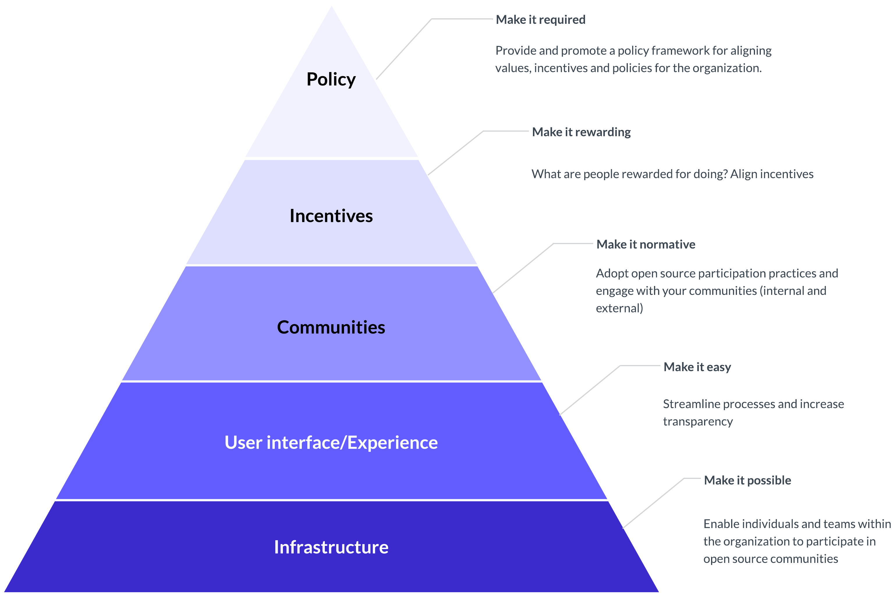
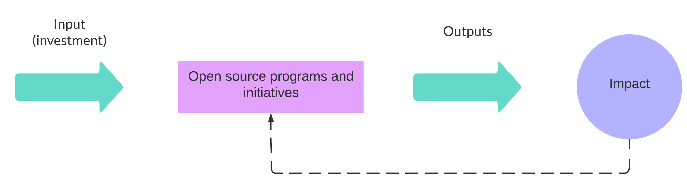
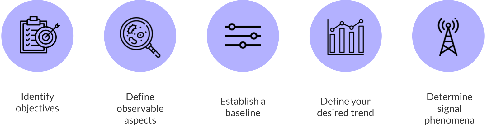

| Learner personas | - [manager/stakeholder](../README.md#managerstakeholder-)                                                                                               |
| ---------------- | ------------------------------------------------------------------------------------------------------------------------------------------------------- |
| Pre-requisites   | - [Module 01: Introduction to Open Source](../01-intro-to-os/)  - [Module 02: Participating in Open Source Communities](../02-participating-in-oss/) |

# Chapter 01: Creating and impactful open source strategy

- [Chapter 01: Creating and impactful open source strategy](#chapter-01-creating-and-impactful-open-source-strategy)
  - [Learning Objectives 🧠](#learning-objectives-)
  - [Where to start? Defining your open source goals 🎯](#where-to-start-defining-your-open-source-goals-)
    - [🙋🏽‍♀️ Learner checkpoint](#️-learner-checkpoint)
    - [Defining an open source strategy](#defining-an-open-source-strategy)
    - [Components of an open source strategy](#components-of-an-open-source-strategy)
  - [Guiding principles for open source strategies and contributions 🧭](#guiding-principles-for-open-source-strategies-and-contributions-)
    - [1. Engagement starts early](#1-engagement-starts-early)
    - [2. The community comes first](#2-the-community-comes-first)
    - [3. Focus on transparency](#3-focus-on-transparency)
    - [4. Align with community standards](#4-align-with-community-standards)
    - [5. End gracefully](#5-end-gracefully)
  - [Implementing and measuring OSS strategies and programs 🌱](#implementing-and-measuring-oss-strategies-and-programs-)
    - [Strategy implementation](#strategy-implementation)
    - [Measuring success](#measuring-success)
  - [Resources 📚](#resources-)
  - [Continue learning 🚥](#continue-learning-)

## Learning Objectives 🧠

- Identify some evolving organizational needs of businesses or organizations regarding their open source strategy
- Revisit and summarize the principles for impactful open source participation (as a corporate contributor)
- Get a high-level overview of how to define success metrics for open source programs

## Where to start? Defining your open source goals 🎯

The previous Modules have introduced you to the world of open source and different ways to participate in OSS. In particular, [Module 02](../02-participating-in-oss/README.md) highlighted some motivations individuals and organizations have to participate in open source communities and some practical recommendations on how to get started and align with the community along the way.

As you have gathered from the previous modules, building good, long-lasting relationships with the ecosystem can be extremely valuable for your organization and employees. This chapter will introduce several guidelines for overcoming challenges when participating in open source communities and setting and organizational open source strategy.

### 🙋🏽‍♀️ Learner checkpoint

Does everyone in your organization or team:

- know what licenses they can use to create or consume products?
- know if you have policies on releasing code as open source?
- know who to contact if they have questions about open source?

### Defining an open source strategy

Organizations need maps to navigate complex open source ecosystems. Such maps (open source strategies) provide everyone in the organization with clear expectations, processes, and policies to guide, support, measure, and recognize their open source contributions.
Your (organization's) open source strategy connects the plans and processes for managing, participating in, and creating OSS within your organization and aligns them with your organization's goals and mission.
Having a clear and documented open source strategy can:

- help gain leadership's buy-in and support
- improve efficiency and mitigate risks
- help facilitate decision-making across teams and the organization's verticals
- explain and clarify your organization's approach to open source in general
- clarify where and why your organization invests in community-driven projects, external R&D, and when to focus on internal efforts and value differentiation

Where to start? 🤔
The following steps will help you define or clarify your open source strategy.

1. **Understand the why of your organization.**

   Before you start defining your open source strategy, it is vital to understand your organization's why.

   - Why does your organization exist?
   - What is your organization's mission?
   - What are your organization's goals?
   - What are your organization's values?
   - How do you measure success within your organization?
   - Who benefits from the work your organization does?

2. **Identify how open source contributes to your organization's goals.**

   Once you clearly understand your organization's mission, goals, and values, you can start aligning your open source strategy with your organization's goals.

   > **Important**
   > The most important question is: **How does open source help your organization achieve its goals and fulfill its mission?**

   For example, if your organization's goal is to "[enable the universal and immediate open sharing of all scientific knowledge, processes, and outputs](https://chanzuckerberg.com/science/programs-resources/open-science/)" then you can directly tie the principles of Open Research and Open Source introduced in [Module 01](../01-intro-to-os/README.md) to your organization's goals. Thus ensuring the long-term sustainability of the scientific open source ecosystem is essential for your organization's success.

   Some questions you should be asking at this point are:

   - Where does the organization use open source?
   - What of our goals heavily rely on open source?
   - Where are we in our open source journey? (consumer, participant, contributor, leader)

3. **Decide on and document your open source strategy.**
   Your open source strategy should connect the plans for managing, participating in, and creating open source software. (Details on what to include in your OSS strategy are provided in [Components of an open source strategy section](#components-of-an-open-source-strategy).)

4. **Design an implementation plan.**

   Once you have identified some goals and strategies, developing an implementation plan will be next. Some questions you should ask at this point are:

   - Which open source projects do we use internally?
   - Which projects should we target for contributions and participation?
   - What contributions are we already making?
   - How should we promote our open source efforts?
   - What contribution processes or guidelines do we need?
   - What training must we provide?
   - How will we determine success?
   - Do we have the relevant expertise, or do we need to hire for it?

5. **Implement your open source strategy.**
   Depending on where your organization is within its open source journey, it might be best to embrace a phased approach to strategy implementation, starting by focusing on its short-to-medium-term goals and reevaluating and adjusting over time.

   > **Note**
   > The section [Implementing and measuring OSS strategies and programs](#implementing-and-measuring-oss-strategies-and-programs-️) in this chapter provides more insight into this step.

### Components of an open source strategy

Your organization's strategy will be the reference or source of truth for open policies, best practices, and processes. It should be understandable and accessible to everyone within your organization.

At the minimum, your strategy should contain the following:

1. **Core principles**
   1. your organization's approach to open source and the purpose behind your strategy
   2. what does success look like for your organization, and how does open source contribute to this success?
2. **Key stakeholders (or key groups and individuals for your open source strategy):** Identifying your stakeholders allow you to answer the question, "How do we know which all to focus on and for whom (is this strategy)?"

   1. by team (i.e., legal, marketing, Imaging Tech)
   2. by the organization (i.e., Science)
   3. by role (i.e., Engineering Director)

   Other practical questions to ask when identifying your stakeholders are:

   - who does this program include?
   - who does this program exclude?
   - who benefits from this?
   - who might be impacted by this program?
   - what other work or areas within our organization would this program touch or change?

3. **Governance:** Standardized governance is critical to streamlining and optimizing processes. It also helps get everyone on the same page and provides the foundation for measuring progress toward your goals and reducing risk.
4. **Expectations for:**
   1. how people should **consume** open source software. This covers items such as licensing, acceptance, vetting, or exception policies, overall stance towards open source development
   2. how people should contribute to open source and projects or ecosystems critical to your organization's goals
   3. how people should develop and release open source projects
   4. open source practices people should observe
5. **Strategy for:**
   1. building open source platforms and tools
   2. building with open source
6. **Policies and other guidelines relevant to OSS, such as:**
   1. Data and supply chain security
   2. Open Source license compliance (including CLA's signing)
   3. Branding and IP guidelines
   4. Starting a new open source project or opening source code
   5. Community standards and repository quality/structure
   6. Community interaction

## Guiding principles for open source strategies and contributions 🧭

In [Module 02](../02-participating-in-oss/README.md), we covered several guidelines and recommendations in open source communities and projects as corporate and individual contributors.

Many of those guidelines can be coded into principles for impactful open source participation, the same principles that should inform and guide your open source strategy:

### 1. Engagement starts early

Engage with the community early in the process of contribution. Build trust, and seek consensus and alignment with the community.

✨ Suggested tactics for this principle:

- Ask questions and remain curious; many community guidelines and expectations are not explicitly documented.
- Before making direct contributions, join the discussion, listen, and ask for feedback.
- Be transparent about your motivations and where you are coming from (i.e., the organization you work for).
- Start contributing to community needs already identified.

### 2. The community comes first

This principle involves putting the community first, balancing interests, and seeking alignment. OSS is all about building in communities; as such, consensus rests with the community, as does the timeline. Individual interests influence the direction of a project and its community. However, the ultimate decision lies within the collective. Be mindful of this and act accordingly.

✨ Suggested tactics for this principle:

- Focus on the contribution and its impact on the community.
- Keep your organization's priorities in mind, but be prepared for the community to have different priorities.
- Don't use your employer, organization, title, or other status signals to influence decisions.
- Avoid imposing or expecting timelines, for example, pushing for changes to be incorporated to meet one of your organization's OKRs.
- When discussing and making decisions that may impact the project internally, make sure to follow the guidelines in [Turn Private Conversations into Public Resources](../02-participating-in-oss/03-good-corporate-oss-citizen.md#turn-private-conversations-into-public-resources-).
- Be mindful of how much you put on and remove the maintainers' plate.
  > **Note**
  > At Quansight Labs, we guide ourselves through the principle of "when mixing paid and volunteer contributors/maintainers, it is our responsibility as paid maintainers to make the lives of the volunteers easier."
- Be respectful and considerate; the community is a powerful (and your best) ally.

### 3. Focus on transparency

Your work on the project should be transparent. This starts by being transparent about your level of commitment to the project (what can you contribute with and in which capacity) as well as your motivations or goals.

You also most probably can't speak officially for your whole organization, but some people will still perceive you as a speaker or representative of your organization. Handle that with care and transparency.

✨ Suggested tactics for this principle:

- We wear many hats when interacting with communities (our own, our company). It is essential to be explicit about which virtual persona you are in each moment ([for example, using your personal or corporate email](https://www.juliaferraioli.com/blog/2022/your-git-email-matters/)).
- Make it explicit in your interactions, especially when joining a community in which capacity you can contribute.

### 4. Align with community standards

Impactful and respectful participation aligns with community standards. This ensures all involved parties adhere to community-established ways of working and rules of engagement. For example, a community's Code of Conduct is a pledge to all its members that no abusive or exclusionary behavior will be tolerated. Failing to follow such guidelines can have significant implications for individual contributors and employers.

✨ Suggested tactics for this principle:

- Make sure to understand a project's community standards.
- Assume positive intent.
- Remember significant context (such as non-verbal cues) can go missing when using communication channels such as email, issue trackers, and Slack messages. Err on providing as much context as needed and favor clear, friendly communication.

### 5. End gracefully

How we end an open source journey is as important as how we start it. How you close an engagement with a project should also follow the above principles.

Especially if you have taken over responsibility, for example, by acting as a maintainer or are in a leadership position, it's crucial to step down gracefully, be transparent, and be respectful.

✨ Suggested tactics for this principle:

- Communicate any substantial changes to your contribution capabilities as early as possible.
- Ensure everything is well documented and share your exit plan.

## Implementing and measuring OSS strategies and programs 🌱

### Strategy implementation

Any type of culture change is complex, and embracing a strategy for open source participation within an organization is no exception. It is important to remember that this is a journey and that it will take time to see the results of your efforts.

It is often tempting to focus on individual levels: individual contributor, a type of/or single contribution or donation, a project, an event, or a team within an organization and measure success based on those. However, it is essential to remember that open source is all about community and collaboration and that the success of your open source strategy will be measured by its impact on the community and the ecosystem.

Focusing on individual levels can often lead to a sense of self-efficacy and removing red tape. However, it can also miss a significant component and sometimes a barrier to impact and change - culture.
Individuals, organizations, and open source projects operate within and belong to [complex sociotechnical systems](https://business.leeds.ac.uk/research-stc/doc/socio-technical-systems-theory). Those systems, in turn, comprise processes, people, infrastructure, technology, metrics and goals, and culture. Any given complex sociotechnical system can only be improved if the social and technical aspects are treated as interdependent and aligned.

To improve your organization's open source impact, you must focus on the technical and social aspects required to accelerate and sustain that impact.

[The Center for Open Science has adopted a strategy for culture change][cos] that can be used as inspiration when adopting or improving your organization's open source strategy and practices.

This strategy requires five progressive levels of intervention:

1. **Infrastructure**: This includes the tools and processes that enable individuals to use and contribute to open source. For example, adopting and using open source software and practices and creating open source platforms and tools.
2. **User experience**: Including processes, training, and tools that facilitate the participation of individuals in open source projects and communities. For example, providing employees with time to contribute to open source projects vital for their job or license guidance.
3. **Community**: At this level, we are trying to make the desired behaviors visible, similar to how we'd expect any contribution to adhere to open source community standards. For example, adopting transparent communication patterns, attending community events, establishing communities of practice, fostering internal collaboration, or establishing an open source champion program.
4. **Incentives**: This level addresses the reward system. For example, providing recognition for open source contributions (including maintenance tasks and no-code contributions), providing opportunities for career advancement, and aligning success metrics with the [principles for impactful open source contributions](#guiding-principles-for-open-source-strategies-and-contributions-).
5. **Policy**: This level addresses alignment between an organization's goals and its open source strategy. For example, governance and IP, open source use and adoption, and security policies.

Successful normative, incentive, and policy interventions require adequate infrastructure and processes that provide an easy transition from how teams and individuals behave and participate in open source today. In turn, enacting cultural changes requires policies and incentive mechanisms that support and reward the desired behaviors.

### Measuring success

> **Warning**
> To date, no canonical set of metrics is characteristic of open source project health. There is no one-size-fits-all approach to measure open source contribution impact and success. However, some approaches can be used as a starting point to measure the impact of your open source strategy and programs.

In the [Components of an open source strategy section](#components-of-an-open-source-strategy) above, you'll notice a dedicated section to identifying your interested groups (a.k.a. stakeholders). Formally identifying, documenting, and regularly reviewing your interested groups helps you define and clarify the following:

- expectations
- needs
- shared outcomes
- potential future work
- how these groups define success

Understanding how your interested groups define success is essential to measuring
and reporting the impact of your open source strategy and programs in a way that is meaningful to them.

> **Important**
> A general suggestion when measuring investment or impact in open source is **avoid estimating ROI (return on investment)** for your open source efforts.

While useful in many contexts and scenarios, ROI is a specific economic model that relates _profits_ to _capital invested_. ROI is not a good fit for measuring the impact of open source contributions and programs as most investments in open source do not readily simplify to standardized monetary equivalents.

Instead, you can focus on the **business impact** of your program. For example, you can use an input-output model of **Investment** : **Impact**.

In this model, you identify and track your investments:

- direct project funding
- event sponsorships
- employee contribution programs
- participation in boards and foundations

You then can identify and track the impacts of those investments in a way that aligns with how your interested groups define success.
An excellent way to demonstrate business impact is through valuable metrics and KPIs (Key Performance Indicators).

⚠️ Some crucial considerations to be aware of:

- **Metrics** are measurements (recorded observations) - in and of themselves, there is no judgment to make.
- **Observations** are **not** unbiased - decisions made (i.e., what to observe, what to leave out, how to observe) bias the outcomes, regardless of the intention. When deciding what to measure, you **must** record these decisions and **clarify** the assumptions and motivations for observing and measuring.
- **KPIs** are a specific kind of metrics that measure the pulse points that correlate to a process, program, or product being considered to be **successful**.

So how do you choose better metrics? Better metrics are **useful** metrics.
This approach can help guide you through the creation of metrics:

1. **Identify objectives**: You need to understand what you want and care about. Available data != valuable metrics.
2. **Define observable aspects**: You need to understand **how what you want** (your objective) **actually works**. Sometimes what you are interested in doesn’t match the data you can collect. In these cases, you can use proxy variables to circumscribe what you are trying to measure.
3. **Establish a baseline for EACH aspect you will measure**: You cannot measure progress or regression without understanding where you start.
4. **Define your desired trend for EACH aspect:** You need to know where you want to go (i.e., more of -> increasing, less of -> decreasing, about the same -> steady state).
5. **Determine your signal phenomena for EACH aspect**: You need to know what changes to expect over time and when they will impact you.
   1. Does your aspect capture events before the impact shows in other metrics? It is a leading signal.
   2. Does your aspect capture events after the impact shows in other metrics? It is a lagging signal.

But remember: metrics for open source should always reflect the goals of **both** the project and the community.

🔗 For an excellent resource on best practices for conducting rigorous, ethical, respectful research that maintains the integrity of the open source ecosystem under consideration, read [Beyond the repository: Best practices for open source ecosystem researchers. Amanda Casari, Julia Ferraioli, and Juniper Lovato][beyond-repo]

When linking or defining what success looks like for your interest groups you can map out what they care about to identify additional metrics which ill help with explaining your vision of success.

| Stakeholder | Why is this stakeholder important to you? | How does this stakeholder define success? | How often does this stakeholder measure our progress? | Signals to explore for KPIs. |
| ----------- | ----------------------------------------- | ----------------------------------------- | ----------------------------------------------------- | ---------------------------- |

> **Warning**
> How often and when to measure KPIs depends on how quickly you expect to see results, or rather how quickly the things you are measuring change.

## Resources 📚

- [Open source policies examples by TODO group](https://github.com/todogroup/policies)
- [Center for Open Science - Strategy for Culture Change][cos]
- [Metrics, spikes, and uncertainty: Open source contribution during a global pandemic.](http://bit.ly/google-opensource-2020-metrics)
- [Beyond the repository: Best practices for open source ecosystem researchers. Amanda Casari, Julia Ferraioli, and Juniper Lovato][beyond-repo]

## Continue learning 🚥

**[Next Chapter: 02 - Creating a New OSS Project](./02-create-new-oss.md)** ➡️

<!-- Reusable links -->

[cos]: https://www.cos.io/blog/strategy-for-culture-change
[beyond-repo]: https://queue.acm.org/detail.cfm?id=3595879
