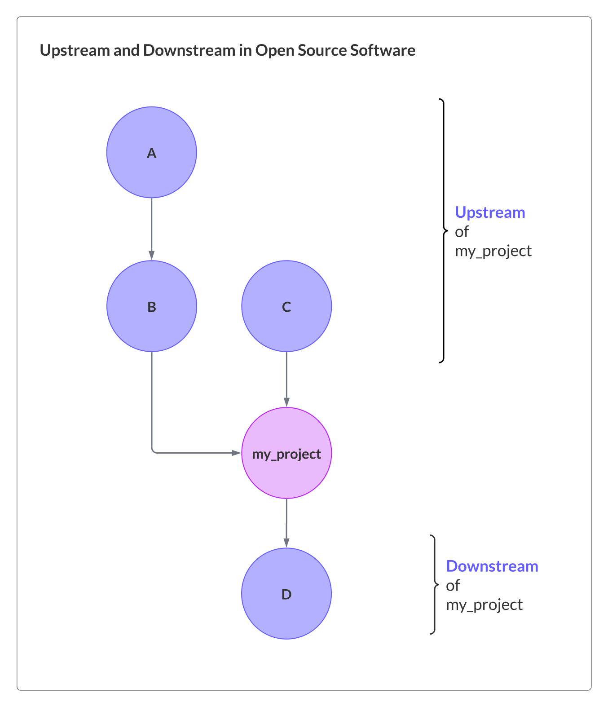

| Learner personas | - [code contributor](../README.md#code-contributor-)  - [code-adjacent contributor](../README.md#code-adjacent-contributor-)  - [manager/stakeholder](../README.md#managerstakeholder-) |
| ---------------- | --------------------------------------------------------------------------------------------------------------------------------------------------------------------------------------------- |
| Pre-requisites   | - [Module 01: Introduction to Open Source](../01-intro-to-os/)  - [Module 02: Participating in Open Source](../02-participating-in-oss/)                                                   |

# Chapter 04: Effective Upstream Contributions

- [Chapter 04: Effective Upstream Contributions](#chapter-04-effective-upstream-contributions)
  - [Learning Objectives 🧠](#learning-objectives-)
  - [Understand Upstream and Downstream Projects ↕️](#understand-upstream-and-downstream-projects-️)
  - [Upstream Engagement Strategy ⬆️](#upstream-engagement-strategy-️)
  - [Collaboration with Downstream Projects ⬇️](#collaboration-with-downstream-projects-️)
  - [Resources 📚](#resources-)
  - [Continue learning 🚥](#continue-learning-)

## Learning Objectives 🧠

<!-- TODO -->

## Understand Upstream and Downstream Projects ↕️

In the open source ecosystem, the terms "upstream" and "downstream" refer to the relationship between different projects that build upon or contribute to each other. They describe the flow of code, changes, and contributions in a software ecosystem. When a project builds on a different project’s functionality, the former become downstream of the latter, as described in the following figure:

Let’s consider pandas. Several PyData libraries like Dask and GeoPandas use pandas data structures (Series and DataFrame) and functions to provide more complex features, hence they are downstream of pandas. pandas itself is partially written in Python, so the CPython project is upstream of pandas. The upstream/downstream terminology is not isolated to core library features. pandas uses Sphinx to generate it’s documentation and pytest for it's test infrastructure, so these libraries are also upstream of pandas.

Related software development terms are “dependency” and “dependents” — they refer to the same relationship, but in more practical terms. A “dependency graph” is a structure used to map this relationship, where each project is a node and they are connected with directed arrows that start at the project providing features(dependents) and end in the project using the feature (dependent). The above figure depicts a dependency graph.

However, not all dependencies are upstream projects (and vice-verse for dependents and downstream projects). Dependencies can be directly mapped to the project’s codebase and include all the external tools required for the project to be developed, packaged, and executed. Upstream projects are a subset of dependencies central to the core value of your project. They are external tools that your project uses heavily and potentially extends. For an example to demonstrate the difference between upstream and dependencies, consider a project that has tests to ensure _downstream_ project stability, this makes the downstream project a dependency of your project.

> **Note**
> GitHub (and some other tools) autogenerates a list of dependencies and dependents based on the project’s packaging-related files like `environment.yml`, `requirements.txt`, `pyproject.toml`, `package-lock.json`, etc. This is useful but may not tell the full story because it doesn’t capturing the depth of the dependency tree and does not including packaging tools used to generate the graphs. Make sure to manually vet autogenerated dependency graphs.

## Upstream Engagement Strategy ⬆️

## Collaboration with Downstream Projects ⬇️

## Resources 📚

- [What is an open source upstream?, Red Hat](https://www.redhat.com/en/blog/what-open-source-upstream)

## Continue learning 🚥
